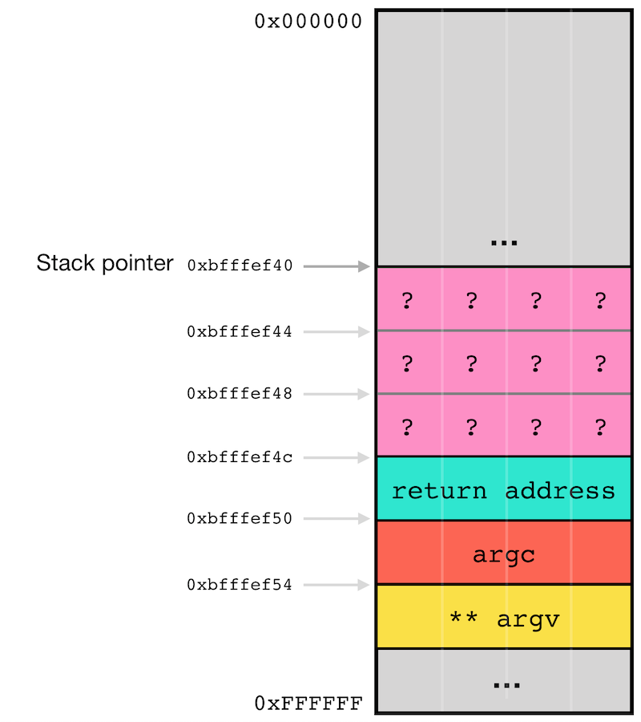

# Assembly

Assembly is a vast topic. We could spend hours, days, month and we still would have plenty to say about. Nevertheless, this is not a reverse engineering course and I’m myself not particularly fluent in assembly, so this course will cover the bare minimum to understand and exploit the vulnerabilities listed for this course, i.e. buffer overflow, format string, use after free and integer over/underflow.

As seen in the [CPU](cpu.md) chapter, instructions are sent to the CPU in the form of binary values of one or multiple bytes. Each binary instruction correspond to one assembly instruction. It is therefore possible to translate binary instructions directly into assembly instructions and the other way round. There is a one-to-one relation between binary instructions sent to CPU and assembly instructions, which is not the case for the relation between C and binary instruction. For instance, this single code line `c = 4 + 2;` in C can be translated in several ways and it will be composed of more than one binary instruction \(CPU operation\).


The translation from binary instructions to its assembly representation is called _to disassemble_, while the other way, i.e. the translation from assembly instructions to their binary instructions is called _to assemble_.


Programs can be developed entirely in assembly. However, if you simply translate assembly instructions to their corresponding binary instructions, the final binary file won't be executable. For this, you need to build a [ELF file](memory.md#elf-pe-file), embed the translated instructions together with _initialized data_ and _global variables_, map the data, build the import table, etc. This is the role of the _compiler_ and _linker_ to do this, but this is another story. In this course we don't want to learn assembly to build application, instead, we want to learn how to read and understand compiled code, which is different a exercise and requires slightly different knowledge and skills in assembly.

An assembly instruction is represented with the following syntax:

```text
instruction [operands] [;comment]
```

The fields in bracket are optional. Each instruction has to be on a different line. The white space between the fields are ignored, so you can have a single space, a tabulation, four spaces, it doesn't matter.

*  `instruction` is the operation executed by the CPU. The x86 architecture CPU have a defined list of [supported instructions](https://en.wikipedia.org/wiki/X86_instruction_listings).
* `operands` can be seen as the argument of the instruction. An instruction can have zero, one, two or three operands. Operands can be a register, a memory address or a constant number. Operands are separated by a single coma.
* At the end of each line, you can add a `comment`, which must be prepended by a semi-colon.

## Hello world!

Let see how our `hello-world.c` application has been translated by the compiler:



```c
#include <stdio.h>

void main(int argc, char** argv)
{
    printf("Hello World!");
}
```



```text
$ gcc hello-world.c -o hello
$ gdb -q hello
Reading symbols from hello...(no debugging symbols found)...done.
(gdb) set disassembly-flavor intel
(gdb) disassemble main
Dump of assembler code for function main:
   0x0804840b <+0>:     lea    ecx,[esp+0x4]
   0x0804840f <+4>:     and    esp,0xfffffff0
   0x08048412 <+7>:     push   DWORD PTR [ecx-0x4]
   0x08048415 <+10>:    push   ebp
   0x08048416 <+11>:    mov    ebp,esp
   0x08048418 <+13>:    push   ecx
   0x08048419 <+14>:    sub    esp,0x4
   0x0804841c <+17>:    sub    esp,0xc
   0x0804841f <+20>:    push   0x80484c0
   0x08048424 <+25>:    call   0x80482e0 <printf@plt>
   0x08048429 <+30>:    add    esp,0x10
   0x0804842c <+33>:    nop
   0x0804842d <+34>:    mov    ecx,DWORD PTR [ebp-0x4]
   0x08048430 <+37>:    leave  
   0x08048431 <+38>:    lea    esp,[ecx-0x4]
   0x08048434 <+41>:    ret    
End of assembler dump.
```

Here, we only disassembled the instructions from the function `main` and we already ended up with 16 assembly instructions. For now, no need to understand why the compiler translated the code like this, just try to understand what each line does independently. Let's dive into it!

#### Line 1: lea ecx,\[esp+0x4\]

```text
   0x0804840b <+0>:     lea    ecx,[esp+0x4]
```

Here is how to read this first line of assembly:

* `0x0804840b` is the address in memory where this binary instruction is located.
* `<+0>` is the offset – in byte – from the beginning of the function `main`. Since we are at the first instruction of `main`, the offset is `0`. Note that on the second line, the offset is `4`, which means the first instruction takes 4 bytes in memory, while on the thrid line, the offset is `7`, which means the second instruction takes 3 bytes in memory \(`7`-`4`\).
* `lea ecx,[esp+0x4]` is the assembly instruction. The assembly syntax start with the instruction followed by zero, one or two operands. Operands are seperated with a coma \(`,`\).


This course is using the intel syntax, which [differs](http://web.mit.edu/rhel-doc/3/rhel-as-en-3/i386-syntax.html) slightly from the AT&T syntax.


`lea` is the _load in effective address_ instruction. What it does is basically calculating what is inside the bracket of the second operand and write the result \(4 bytes\) in the first operand. So the instruction at `0x0804840b` is reading the content of the register `esp`, add 4, and store the result in the register `ecx`.


If you remember from chapter memory, the register `esp` is pointing to the top of the stack.


```text
(gdb) break *0x0804840b
Breakpoint 1 at 0x804840b
(gdb) run
Starting program: /home/lab/hello 

Breakpoint 1, 0x0804840b in main ()
(gdb) info registers esp
esp            0xbfffef4c	0xbfffef4c
```

When the instruction is executed, the register `esp` contains the value `0xbfffef4c`. So after execution, `ecx` stores `0xbfffef50` \(`0xbfffef4c` + `0x04`\).

Let's verify it:

```text
(gdb) info registers ecx
ecx            0xdff71327	-537455833
(gdb) nexti
0x0804840f in main ()
(gdb) info registers ecx
ecx            0xbfffef50	-1073746096
```

So, all went as expected. But why copying that value in `ecx`? What is even stored at `[esp+0x4]`? 

First of all, remember that the stack is "growing" **downward**, which means if you add new content to the stack, the stack pointer, which always point to the top of the stack, will **decrease** \(see chapter [memory](memory.md#stack)\). So `[esp+0x4]` is pointing to a variable inside the stack at an offset of 4 bytes from the top of it. As seen in chapter [Memory](memory.md) - [Stack](memory.md#stack), function arguments are \(usually\) pushed to the stack prior to call the function. When the function is called, the _return address_ is pushed to the stack \(right above the arguments\).

At this point, when the CPU reached the first instruction from the function `main`, the stack looks like this:



Note that the data is stored in little-endian, which means if the value `0xb7e21637` is stored at the address `0xbfffef4c`, it actually means `0x37` is stored at 0xbfffef4c, `0xef` is stored at `0xbfffef4d`, `0xff` is stored at `0xbfffef4e` and `0xbf` is stored at `0xbfffef4f`.


This means `[esp]` point to the _return address_ `0xb7e21637` and `[esp+0x4]` points to `argc`,  the first argument of main. So, even if we don't use it in our C code, our compiled program has an instruction that saves the address where the first argument is located into the `ecx` register. I don't know why, but it doesn't matter for now, let's move to the next instruction.

#### Line 2: and esp,0xfffffff0

`and` is doing exactly what the name implies: it executes the logic _AND_ operation with the two operands. The result \(4 bytes\) is then stored in the first operand. Furthermore, the following flags \(see chapter [memory](memory.md#flags-register)\) are updated after the operation:

* `CF`: carry flag is cleared
* `OF`: overflow flag is cleared
* `PF`: parity flag is set according to the result
* `ZF`: zero flag is set according to the result
* `SF`: sign flag is set according to the result
* `AF`: state of adjust flag after AND operation is undefined

```text
(gdb) info registers esp
esp            0xbfffef4c	0xbfffef4c
(gdb) info registers eflags
eflags         0x296	[ PF AF SF IF ]
(gdb) nexti
0x08048412 in main ()
(gdb) info registers esp
esp            0xbfffef40	0xbfffef40
(gdb) info registers eflags
eflags         0x282	[ SF IF ]
```

In the first four lines of this GDB command output, we read the content of `esp` and the `eflag` register, then we execute the `and` instruction, and finally, in the four last lines, we read again the content of `esp` and the `eflag` registers to see the changes done by the AND operation.

Once the instruction executed, the stack looks like this:




AND operation on the `esp` register are often done at the beginning of the `main` function to re-align the stack address, i.e. be a mutliple of `0x10` \(16\) \[[1](https://stackoverflow.com/a/28475252)\]


#### Line 3: push DWORD PTR \[ecx-0x4\]

The `push` instruction adds the operand value onto the top of the stack. `esp` is updated accordingly \(decrement by 4\). The operand is `DWORD PTR [ecx-0x4]`:

* `ecx-0x4`: Takes the value stored in `ecx` and subtract `0x4` \(4 in decimal\).
* `[` `]`: Consider the value calculated inside the bracket as a memory address and the `push` instruction is actually storing into the stack the value pointed by this address \(instead of the address itself\). 
* `DWORD PTR`: Stands for **D**ouble **WORD** \(4 bytes\) **P**OIN**T**E**R**. This means the pointed data should be considered as a 4 bytes variable.

`ecx` contains the memory address where `argc` is stored in the stack \(see [line 1](assembly.md#line-1-lea-ecx-esp-0-x4)\). Since addresses are 4-bytes long, subtracting four is basically looking at the variable stored before `argc`, which in this case is the _return address_ `0xb7e21637`. So, the `push` instruction will add to the stack a copy of the _return address_:


#### Line 4: push ebp

When used without bracket, the instruction `push` with a register as operand simply pushes \(add\) on top of the stack the value stored in the register and update `esp` accordingly \(decrement by 4\). 


Actually, it's more the other way round, `esp` is decremented by 4, then the value of `ebp` is copied to the memory location pointed by `esp`.


The register `ebp` is used as a **b**ase **p**ointer for the stack frame \(see chapter [Memory](memory.md) - [Stack](memory.md#stack)\).


#### Line 5: mov ebp,esp

The `mov` instruction is one of the most used instruction. When the operands are two registers, it copies the content of the second operand and overwrite the content of the first operand with it. In this case, when the CPU reaches that instruction, the stack pointer \(`esp`\) contains `0xbfffef38`. Once the instruction executed, the base pointer \(`ebp`\) will also contain `0xbfffef38`.

```text
(gdb) info registers esp
esp            0xbfffef38	0xbfffef38
(gdb) info registers ebp
ebp            0x0	0x0
(gdb) nexti
0x08048418 in main ()
(gdb) info registers esp
esp            0xbfffef38	0xbfffef38
(gdb) info registers ebp
ebp            0xbfffef38	0xbfffef38
```

The registers `ebp` and `esp` are now both pointing to the top of the stack.

#### Line 6: push ecx

We've seen the `push` instruction twice already, so you should know what it does by now, i.e. it will pushes the content of the register `ecx` on the stack. If you remember, in [line 1](assembly.md#line-1-lea-ecx-esp-0-x4), `ecx` contains the stack address where the the first argument of main \(`argc`\) is saved.


#### Line 7: sub esp,0x4

`sub` stands for _subtracting_. It takes the first operand and subtract the second one to it. The result is than saved in the first operand. This instruction could be basically interpreted as `esp = esp - 0x4`.

```text
(gdb) info registers esp
esp            0xbfffef34	0xbfffef34
(gdb) nexti
0x0804841c in main ()
(gdb) info registers esp
esp            0xbfffef30	0xbfffef30
```


Subtracting from `esp` is basically allocating memory in the stack for local variable\(s\). However, bear in mind that the newly allocated memory memory space is not initialized, so this memory area has unknown data from previous stack usage.



#### Line 8: sub esp,0xc

Surprisingly enough, the next instruction also subtract a static number to `esp`. I don't why this is done over two instruction instead of, for instance, this single equivalent instruction: `sub esp, 0x10`.

```text
(gdb) info registers esp
esp            0xbfffef30	0xbfffef30
(gdb) nexti
0x0804841f in main ()
(gdb) info registers esp
esp            0xbfffef24	0xbfffef24
```


#### Line 9: push 0x80484c0 

When `push` is used with a direct value instead of a register, the value itself is pushed to the stack. But what is `0x80484c0`? Why is it pushed to the stack? Let's have a look at the section mapping to see from which section this address belong to:

```text
(gdb) maintenance info sections 
Exec file:
    `/home/lab/hello', file type elf32-i386.
 ...
 [12]     0x8048300->0x8048308 at 0x00000300: .plt.got ALLOC LOAD READONLY CODE HAS_CONTENTS
 [13]     0x8048310->0x80484a2 at 0x00000310: .text ALLOC LOAD READONLY CODE HAS_CONTENTS
 [14]     0x80484a4->0x80484b8 at 0x000004a4: .fini ALLOC LOAD READONLY CODE HAS_CONTENTS
 [15]     0x80484b8->0x80484cd at 0x000004b8: .rodata ALLOC LOAD READONLY DATA HAS_CONTENTS
 ...
 [24]     0x804a014->0x804a01c at 0x00001014: .data ALLOC LOAD DATA HAS_CONTENTS
 [25]     0x804a01c->0x804a020 at 0x0000101c: .bss ALLOC
 [26]     0x0000->0x0035 at 0x0000101c: .comment READONLY HAS_CONTENTS
```

The address `0x80484c0` is part of the `.rodata` section, which contains read-only initialized static variables \[[1](https://en.wikipedia.org/wiki/Data_segment)\]. Let's have a look at the content pointed by this variable:

```text
(gdb) x/x 0x80484c0
0x80484c0:	0x6c6c6548
```

If you some experience with reversing, you should quickly noticed that each bytes of this 32 bits value are in the range between `0x20` and `0x7d`, which are all printable ASCII characters. So `0x80484c0` might actually be pointing to a ASCII string:

```text
(gdb) x/s 0x80484c0
0x80484c0:	"Hello World!"
```

So `0x80484c0` is actually a pointer to the string "Hello World!" stored in the `.rodata` section. The instruction in line 9 is pushing that address to the stack.


#### Line 10: call 0x80482e0 printf@plt 

The `call` instruction redirects the execution flow by changing the instruction pointer \(`EIP`\) with the address mentioned as operand. Usually, this operand is an address to a function. However, before it does that, it `push` to the stack the address of the following instruction. This address saved in the stack so that later, whenever the function if done, the program knows where to return.


The instruction is actually `call 0x80482e0`, but GDB ❤ is kind enough to let us know that `0x80482e0` is actually the address of `printf` in the `plt` table.


Let see the instruction `call` in action:

```text
(gdb) x/3i $eip
=> 0x8048424 <main+25>:	call   0x80482e0 <printf@plt>
   0x8048429 <main+30>:	add    esp,0x10
   0x804842c <main+33>:	nop
(gdb) x/3x $esp
0xbfffef20:	0x080484c0	0xbfffefe4	0xbfffefec
(gdb) stepi 
0x080482e0 in printf@plt ()
(gdb) x/3i $eip
=> 0x80482e0 <printf@plt>:	jmp    DWORD PTR ds:0x804a00c
   0x80482e6 <printf@plt+6>:	push   0x0
   0x80482eb <printf@plt+11>:	jmp    0x80482d0
(gdb) x/3x $esp
0xbfffef1c:	0x08048429	0x080484c0	0xbfffefe4
```

In lines 1-4, I print the current and the next two instructions. We can see that the instruction pointer is not pointing to the `call 0x80482e0`. In line 5-6, I print the first 3 words on top of the stack. As seen in the [previous instruction](assembly.md#line-9-push-0x-80484-c0), the last `push` to the stack was with the pointer to "Hello World!", i.e. `0x080484c0`. We then execute the `call` instruction in line 7 with the GDB command `stepi` and **not** `nexti` \(see the difference in chater [lab](lab.md#gdb)\). One the command executed, we can see in lines 9-12 that the instruction pointer is now pointer to `0x80482e0`, the first operand of the executed `call` instruction. Finally, we see in lines 13-14 that the address of the instruction located right \(i.e. `0x08048429`\) after the call instruction has been pushed to the stack.


Here, we will not follow the `printf@plt` execution flow, instead we will tell GDB to continue the execution until we get back to `main` function:

```text
(gdb) finish
Run till exit from #0  0x080482e0 in printf@plt ()
0x08048429 in main ()
(gdb) x/3i $eip
=> 0x8048429 <main+30>:	add    esp,0x10
   0x804842c <main+33>:	nop
   0x804842d <main+34>:	mov    ecx,DWORD PTR [ebp-0x4]
```

We are now back in the `main` function, at the instruction located right after the `call 0x80482e0`.

```text
(gdb) x/3x $esp
0xbfffef20:	0x080484c0	0xbfffefe4	0xbfffefec
```


#### Line 11: add esp,0x10 

As its name implies, the instruction `add` operates an addition with the first operand and the second operand. The result is then saved in the first operand.

```text
(gdb) info registers esp
esp            0xbfffef20	0xbfffef20
(gdb) nexti
0x0804842c in main ()
(gdb) info registers esp
esp            0xbfffef30	0xbfffef30
```


Adding to `esp` is basically cleaning the stack and remove memory local variable\(s\) from the stack.



#### Line 12: nop 

The `nop` is an interesting instruction since it does absolutely nothing. `nop` stands for **N**o **OP**eration. When the CPU reach that instruction, it won't do anything and just move to the next one. The `nop` instruction is stored in memory as the machine instruction  `0x90`, one single byte. So if we want to be very accurate, the `nop` instruction is actually doing something:  incrementing the instruction pointer by one:

```text
(gdb) info registers eip
eip            0x804842c	0x804842c <main+33>
(gdb) nexti
0x0804842d in main ()
(gdb) info registers eip
eip            0x804842d	0x804842d <main+34>
```

#### Line 13: mov ecx,DWORD PTR \[ebp-0x4\] 

We've seen it already, the mov instruction is copying the content of the second operand into the first operant. The first operand \(moving destination\) is pretty clear, i.e. the register `ecx`. However, the first operand \(moving source\) might need a few explanation:

* `ebp-0x4`: Takes the value stored in `ebp` and subtract `0x4` \(4 in decimal\).
* `PTR [` `]`: Consider the value calculated inside the bracket as a memory address and the `mov` instruction is actually copying the value pointed by this address \(instead of the address itself\). 
* `DWORD`: Stands for _D_ouble _WORD_ \(4 bytes\). This means the pointed data should be considered as a 4 bytes variable.

The register `ebp` was set in [line 5](assembly.md#line-5-mov-ebp-esp) and is used as the base pointer of the stack frame for the function `main`. When accessing data with a **negative** offset to `ebp`, we usually try to access local variable of the function to which the stack frame belong to. While if we try to access data with **positive** offset to `ebp`, this will most likely by argument to the function to which the stack frame belong to.

So here, `ebp-0x4` is the address where the register `ecx` was saved earlier in [line 6](assembly.md#line-6-push-ecx). So basically, in line 6, we saved `ecx` in the stack, then we do something \(between line 7 and 13\) which might alter `ecx`, and later in line 14, we restore the initial value saved in line 6 back in `ecx`.

```text
(gdb) info registers ecx
ecx            0x804b014	134524948
(gdb) x/x $ebp-4
0xbfffef34:	0xbfffef50
(gdb) nexti
0x08048430 in main ()
(gdb) info registers ecx
ecx            0xbfffef50	-1073746096

```

#### Line 14: leave

The instruction `leave` is meant to reset the stack as it was at the beginning of the function. For this, is copies the content of the base pointer \(`ebp`\) in the stack pointer \(`esp`\), which releases the stack space allocated to the stack frame \(e.g. local variables\), then it copies the the variable on top of the stack in the base pointer \(`ebp`\). It is basically the equivalent of the following instructions:

```text
mov esp, ebp
pop ebp
```


We haven't seen the `pop` instruction yet. `pop` is kind of the opposite of `push`. It takes the 4-bytes value on top of the stack and stores it in the first operant. Then it updates the the stack pointer accordingly, i.e. subtract 4 from `esp`.


#### Line 15: lea esp,\[ecx-0x4\]

The instruction `lea` was the [first one](assembly.md#line-1-lea-ecx-esp-0-x4) we've seen. It actually works a bit like `mov`, except that it has a different syntax. When using bracket for the second operand, `lea` calculates what is inside and copies the result in the first operand; while `mov` calculates what is inside the bracket and copies the value pointed by the resulted address in the first operand.

So here, we take the value stored in `ecx`, subtract `0x4` and save the result in `esp`:

```text
(gdb) info registers ecx
ecx            0xbfffef50	-1073746096
(gdb) info registers esp
esp            0xbfffef3c	0xbfffef3c
(gdb) nexti
0x08048434 in main ()
(gdb) info registers esp
esp            0xbfffef4c	0xbfffef4c
```


At this point of time, `ecx` is pointing to the first argument of the function `main`. The address just above \(i.e. -0x4\) is actually the _return address_ of the main's callee function, i.e. `__libc_stat_main`.

#### Line 16: ret

Finally, the last line: the instruction `ret`! That last instruction is the equivalent of `pop eip`: it redirects the execution flow to the address stored at the top of the stack. This is meant to return to the callee, right after the `call` instruction.


The instruction pointer `eip` cannot be used as operand. So we cannot use `lea`, `mov`, `pop`, `push` with that register. That's why we have special instructions meant to manipulate eip \(and thus the execution flow\), like `call`, `jmp` or `ret`.


Now you understand why the `call` instruction is pushing to the stack the address of the next instruction \(also known as **return address**\): so that at the end of the called function, `ret` can be used to come back where it was initially. But that means that before we execute `ret`, we need to clean the stack and make sure `esp` is pointing to that **return address** previously pushed by `call`.

```text
(gdb) x/3i $eip
=> 0x8048434 <main+41>:	ret    
   0x8048435:	xchg   ax,ax
   0x8048437:	xchg   ax,ax
(gdb) x/3x $esp
0xbfffef4c:	0xb7e21637	0x00000001	0xbfffefe4
(gdb) nexti
0xb7e21637 in __libc_start_main [...]
(gdb) x/3i $eip
=> 0xb7e21637 <__libc_start_main+247>:	add    esp,0x10
   0xb7e2163a <__libc_start_main+250>:	sub    esp,0xc
   0xb7e2163d <__libc_start_main+253>:	push   eax
(gdb) x/3x $esp
0xbfffef50:	0x00000001	0xbfffefe4	0xbfffefec
```

In the four first lines, we list the current and next instructions. The two instructions after `ret` are `xchg ax,ax`. The function is usually finished after ret, what follows in memory is usually another function or some filler between functions. 


The `xchg` instruction exchange the content of the two operands. Here in this case, exchanging the content of the register `ax` with the register `ax` does nothing. Sometime, the compiler/linker uses `chxg ax,ax`, instead of the`nop` instruction  because it takes 2 bytes in memory \(i.e. 0x66 0x90\) and not one byte like the `nop` instruction, which makes it easier for the memory alignment \[[2](https://stackoverflow.com/a/2136065)\]. `xchg ax,ax` is often used as filler.


So the current instruction is `ret` and the top of the stack contains the value `0xb7e21637` as seen in lines 5-6. Once the instruction `ret` executed, the execution flow got redirected back in the function `__libc_stat_main` \[[3](http://refspecs.linuxbase.org/LSB_3.1.0/LSB-generic/LSB-generic/baselib---libc-start-main-.html)\] at the address `0xb7e21637`. And when we look at the stack in lines 13-14, the address has been popped out and the top of the stack is now pointing at the next variable.


The function `__libc_stat_main` is the initialization routine that starts the `main` function.


And voila, this was was the assembly translation for the `main` function of _hello-world.c_ by gcc 5.4.0! I hope this wasn't too painful for you to follow.

#### Wrap up

Reading line by line assembly is rather easy. The main complexity lies in building a comprehensive understanding of what the function \(or pieces of function\) does: putting all the lines together to make sense out of it and understanding what the developer intended to it.

Most of lines we've seen doesn't make too much sense or seems useless. To be honest, the function `main` could have been simplified with the following 4-lines:

```text
push   0x80484c0
call   0x80482e0
add    esp, 0x4
ret
```

But instead, we have all those noisy useless lines. Why? The main reason is optimisation, e.g. reduce compilation time, execution time, output size, etc. Compilers are incredibly complex and well written. So what seems to be stupid and/or useless lines are usually meant to be like that.

Those extra lines are actually what you will struggle a lot when reversing applications. Through experience, you will learn to find naturally the appropriate depth of understanding in the assembly code, i.e. ignoring line\(s\) because considered as useless to understand \(in the context of your task\) or on the contrary taking it/them into consideration.

## Comments

Comments in assembly start with a semi-colon \(`;`\). Comments are not multi-lines, so if you want to have comments on consecutive lines, you will simply need to use a semi-colon at each line. Comments can be placed on empty lines or behind an instruction:

```text
push   0x80484c0  ; Pointer to the string "Hello World!"
call   0x80482e0  ; Call printf
add    esp,0x4    ; Remove the pushed argument (i.e. "Hello World!")
; The return address is now at the top of the stack
ret
```

## Variables

There are three main areas where variables are located. Static/Global variables are located in a fix memory location \(usually in the _.data_ or _BSS_ segment\), arguments and local variables of functions are located in the stack, and finally, dynamically allocated variables are located in the heap.

Unlike in C, compiled code \(without debug information\) do not have alias for variables. If you want to read or manipulate a variable, you need to provide the address where the variable is located \(or an offset that points to that memory location\).

### Type verification

Variables in assembly don't really have a type. Address point to binary data. The way you want to manipulate that data is entirely up to you. You could for instance execute a multiplication operation between two characters from a string. 

One thing the CPU needs to know though is on how many bytes the instruction operates: **BYTE**, **WORD** or **D**ouble **WORD**.

```text
mov al,  BYTE PTR [esp] ; Copies the  4-bit value at the top of the stack in  AL
mov ax,  WORD PTR [esp] ; Copies the 16-bit value at the top of the stack in  AX
mov eax,DWORD PTR [esp] ; Copies the 32-bit value at the top of the stack in EAX
```

### Allocating memory

Function variables are usually located in the stack. The size in memory depends on the type of the variable when declared in C. Whenever we enter a function, we usually have the _prolog_, which is preparing the stack frame, then we have the memory allocation, which basically subtract the total size of all function memory to the stack pointer.



```c
#include <stdio.h>

void add(int, int); // Function prototype

void main(int argc, char** argv)
{
    add(16, 26);
}

void add(int a, int b)
{
    int x;
    int y;
    int sum;
    char sign;
    
    x = a;
    y = b;
    
    sum = x + y;
    
    if(sum > 0)
        sign = '+';
    else
        sign = ' ';
    
    printf("%d + %d = %c%d", x, y, sign, sum);
}
```



If we look at the function add, we have 3 integers and 1 char. Integers are 4 bytes long and sign are 1 byte longs. We should therefore have \(3 x 4\) + 1 = 13 bytes allocated at the beginning of the function.

```text
$ gcc add.c -o add
$ gdb -q add
Reading symbols from add...(no debugging symbols found)...done.
(gdb) set disassembly-flavor intel
(gdb) disassemble add
Dump of assembler code for function add:
   0x08048434 <+0>:	push   ebp
   0x08048435 <+1>:	mov    ebp,esp
   0x08048437 <+3>:	sub    esp,0x18
   ...
```

As you can see after the _prolog_, we subtract 0x18 to the the stack pointer... 0x18, not 0xd... why? The two main reasons why the allocated memory space doesn't match the total size of local variable are:

1. Sometimes, variable doesn't need to be stored in the stack and registers are sufficient. In this case we would see less memory allocated. But this could also be the other way round, during the translation from C to assembly, the compiler might notice that extra memory should be allocated for intermediate variables that was not needed to declare in C.
2. In order to keep the stack aligned, the compiler will allocate extra space in the stack so that stack pointer is a multiple of 16.

In our case, the 0x18 bytes allocated instead of the 0xd bytes needed are most likely meant to keep the stack aligned:

```text
(gdb) break *0x08048439
Breakpoint 1 at 0x8048439
(gdb) run
Starting program: /home/lab/add 

Breakpoint 1, 0x08048439 in add ()
(gdb) info registers esp 
esp            0xbfffef18	0xbfffef18
(gdb) nexti
0x0804843a in add ()
(gdb) info registers esp
esp            0xbfffef00	0xbfffef00
```

As we can see, after the memory allocation, the stack is a multiple of 16.

Once the memory allocated, local variables are usually first referenced as an offset to `esp` or `ebp`. Sometimes, instead of always using that offset, the direct memory address \(calculate based on the offset\) can be saved in a register and so that later, access to that variable is done via that register.

The order of the variables in the stack doesn't necessary match the order when variables are declared in the C code. For instance, in our last program, the stack looked like this:


### Assigning value

The main ways to assign a value to a variable \(i.e. copying data to a given memory address\) is by using the `mov` instruction. However, a variable is usually not manipulated directly in memory, its content is often first copied in a register where data can be processed \(e.g. arithmetic or logical operation\) in a faster way \(see chapter [memory](memory.md#registers)\).

There are three other instructions meant for moving data: `lea` and `push` and `pop`. We've seen most of those instructions in the chapter [Hello World!](assembly.md#hello-world), but let's have a closer look at them.

#### mov - move data

The `mov` instruction copy the content referenced by the second operand and overwrite the content referenced by the first operand with it. Note that it is not possible to move data memory-to-memory. For instance, we cannot move the content located at `0x08001122` to the address `0x08221100` in one instruction. For this, we would need to first copy the content of `0x08001122` in a register, then copying the register to `0x08221100`. Here are some examples:

```text
mov eax, ebx   ; Copy the content of ebx to eax
mov eax, 0x42  ; Write the value 0x00000042 in eax
mov eax, [ebx] ; Copy the content pointed by ebx to eax
mov [eax], ebx ; Copy the content of ebx to the memory location pointed by eax
mov eax, [ebp+0x8] ; Calculate the value stored in ebp + 0x8, then copy the content pointed by the resulted address to eax
mov [0x08001122], eax ; Copy the content of eax to the memory address 0x08001122
mov eax, [0x08001122] ; Copy the content located at 0x08001122 in eax
```

When using pointer, it might be sometimes ambiguous whether you want to copy one, two or four bytes. For instance, let's consider the following instruction:

```text
mov [eax], 0x42
```

Does it mean we want to copy the byte `0x42` to the memory location pointed by `eax`? Or should it copy `0x0042`? or `0x00000042`?


To avoid this ambiguity, whenever it's not clear we have to specify how many bytes we want to copy with _size directive_. In 32-bit architecture, _size directive_ can be:

* `BYTE PTR`: One byte
* `WORD PTR`: Two bytes \(word\)
* `DWORD PTR`: Four bytes \(double word\)


```text
mov  BYTE PTR [eax], 0x42 ; Copy 0x42 and overwrite the single byte pointed by eax
mov  WORD PTR [eax], 0x42 ; Copy 0x0042 and overwrite two bytes starting from where eax point to
mov DWORD PTR [eax], 0x42 ; Copy 0x00000042 and overwrite four bytes starting from where eax point to
```

#### lea - load effective address

Like the `mov` instruction, `lea` copies data from the second operand to the first operand. The main difference with `mov` is that the second operand always uses bracket \(`[` `]`\), however here, `lea` doesn't copy the pointed value but the _effective address_, meaning the actual address calculated within bracket. Here are some examples:

```text
lea eax, [ebx] ; Copy the content of ebx to eax (equivalent of mov eax, ebx)
lea eax, [ebp+0x8] ; Calculate the value stored in ebp + 0x8, then copy the resulted address to eax
lea eax, [0x08001122] ; Write the value 0x08001122 in eax
```

Although `lea` and `mov` seem very similar, `lea` is still useful. If you want to store an offset address to a register, you can do it in a single `lea` instruction:

```text
; without lea
mov eax, ebp
add eax, 0x8
; with lea
lea eax, [ebp+0x8]
```

#### push - add data on top of the stack

The `push` instruction will add on top of the stack the 4-bytes value referenced by the operand. Since the stack is growing backward \(see chapter [memory](memory.md#stack)\), the push instruction will first decrement `esp` \(the stack pointer\) by 4, then move the content referenced by the operand to the memory location pointed by `esp`.

```text
; without push
sub esp, 0x4
mov esp, eax
; with push
push eax
```

The operand can be a register or a direct value:

```text
push eax ; Place the content in eax at the top of the stack
push [eax] ; Place the content pointed by eax at the top of the stack
push 0x42 ; Place the value 0x00000042 at the top of the stack
push [0x08001122] ; Place the content located at 0x08001122 at the top of the stack
```

#### pop - extract data from the top of the stack

The `pop` instruction is more or less the opposite of `push`: it copies the 4-bytes value pointed by `esp` \(at the top of the stack\) to the operand and increment `esp` by 4.

```text
; without pop
mov eax, esp
add esp, 0x4
; with pop
pop eax
```

The operand can be a register or a direct value:

```text
pop eax ; Place the content at the top of the stack in eax
pop [eax] ; Place the content at the top of the stack at the address pointed by eax
pop [0x08001122] ; Place the content at the top of the stack at the address 0x08001122
```

## Math/Logic operations

CPU are basically a big complex calculator. It has its own area solely meant for arithmetic and logic operations. Natively, the CPU can perform the following operation in one single instruction:

* Addition/Subtraction
* Incrementing/Decrementing
* Multiplication/Division
* AND operation
* OR operation
* XOR operation
* NOT operation
* NEG operation
* Shift left/Shift right

The below descriptions of arithmetic operations are for integer values only. More arithmetic operations exist\( for floating point for instance\) but we will not cover them in this course.


In the below examples, you should see each line as independent and not being part of the same program. Since instructions change the content of registers, those changes are not taken into consideration in the next line.


#### add - addition

The `add` instruction adds the referenced value by the second operand with the referenced value by the first operand and save the result in the first operand.

```text
; eax = 0xbfff1122
; ebx = 0x00000042
; 0xbfff1122 is pointing to the value 0x00001337
add eax, ebx   ; eax = 0xbfff1164
add ebx, [eax] ; ebx = 0x00001379
add [eax], ebx ; 0xbfff1122 is now pointing to the value 0x00001379
add eax, 0x42   ; eax = 0xbfff1164
add DWORD PTR [eax], 0x42 ; 0xbfff1122 is now pointing to the value 0x00001379
add DWORD PTR [0xbfff1122], 0x42 ; 0xbfff1122 is now pointing to the value 0x00001379
add ebx, [0xbfff1122]  ; ebx = 0x00001379
```

As for any instruction, we cannot use direct memory address for both operands at the same time.

#### sub - subtraction

The `sub` instruction subtract the referenced value by the second operand to the referenced value by the first operand and save the result in the first operand.

```text
; eax = 0xbfff1122
; ebx = 0x00000042
; 0xbfff1122 is pointing to the value 0x00001337
sub eax, ebx   ; eax = 0xbfff10e0
sub ebx, [eax] ; ebx = 0xffff2d0b (signed -4853 or unsigned 4294962443)
sub [eax], ebx ; 0xbfff1122 is now pointing to the value 0x000012f5
sub eax, 0x42   ; eax = 0xbfff10e0
sub DWORD PTR [eax], 0x42 ; 0xbfff1122 is now pointing to the value 0x000012f5
sub DWORD PTR [0xbfff1122], 0x42 ; 0xbfff1122 is now pointing to the value 0x000012f5
sub ebx, [0xbfff1122]  ; ebx = 0xffff2d0b
```

#### inc - incrementing

The `inc` instruction increments by 1 the referenced value by the operand.

```text
; eax = 0xbfff1122
; 0xbfff1122 is pointing to the value 0x00001337
inc eax   ; eax = 0xbfff1123
inc [eax] ; 0xbfff1122 is now pointing to the value 0x00001338
inc [0xbfff1122] ; 0xbfff1122 is now pointing to the value 0x00001338
```

#### dec - decrementing

The `dec` instruction decrements by 1 the referenced value by the operand.

```text
; eax = 0xbfff1122
; 0xbfff1122 is pointing to the value 0x00001337
dec eax   ; eax = 0xbfff1121
dec [eax] ; 0xbfff1122 is now pointing to the value 0x00001336
dec [0xbfff1122] ; 0xbfff1122 is now pointing to the value 0x00001336
```

#### imul - integer multiplication

The `imul` instruction has two formats. One with two operands and one with three operands. The first format multiplies the referenced value by the first operand with the referenced value by the second operand and save the result in the first operand. The second format multiplies the referenced value by the second operand with the the constant value in the third operand and saves the result in the first operand. In both format, the first operand must be a register.

```text
; eax = 0xbfff1122
; ebx = 0x00000042
; ecx = 0x0000cafe
; 0xbfff1122 is pointing to the value 0x00001337
imul ebx, ecx   ; ebx = 0x0034557c
imul ebx, [eax] ; ebx = 0x0004f42e
imul ebx, [0xbfff1122] ; ebx = 0x0004f42e
imul ebx, ecx, 0x3   ; ebx = 0x000260fa
imul ebx, [eax], 0x3 ; ebx = 0x000039a5
imul ebx, [0xbfff1122], 0x3 ; ebx = 0x000039a5
```

#### idiv - integer division

The `idiv` instruction divides the 64-bits register concatenation `edx`:`eax` by the operand reference value. The quotient result is stored in `eax` and the reminder is stored in `edx`.

```text
; edx = 0x00000011
; eax = 0x22334455
; ebx = 0xbfff1122
; ecx = 0x00000042
; 0xbfff1122 is pointing to the value 0x00001337
idiv ecx   ; eax = 0x427523f1 and edx = 0x00000033 
idiv [ebx] ; eax = 0x00e4457d and edx = 0x00000f7a 
idiv [0xbfff1122] ; eax = 0x00e4457d and edx = 0x00000f7a 
```

#### and

The `and` instruction execute a logic AND operation the between referenced values of both operands and save the result in the first operand.

```text
; eax = 0xbfff1122
; ebx = 0x12345678
; 0xbfff1122 is pointing to the value 0x00001337
and eax, ebx   ; eax = 0x12341020
and ebx, [eax] ; ebx = 0x00001230
and [eax], ebx ; 0xbfff1122 is now pointing to the value 0x00001230
and eax, 0x42   ; eax = 0x00000002
and DWORD PTR [eax], 0x42 ; 0xbfff1122 is now pointing to the value 0x00000002
and DWORD PTR [0xbfff1122], 0x42 ; 0xbfff1122 is now pointing to the value 0x00000002
and ebx, [0xbfff1122]  ; ebx = 0x00001230
```

#### or

The `or` instruction execute a logic OR operation between the referenced values of both operands and save the result in the first operand.

```text
; eax = 0xbfff1122
; ebx = 0x12345678
; 0xbfff1122 is pointing to the value 0x00001337
or eax, ebx   ; eax = 0xbfff577a
or ebx, [eax] ; ebx = 0x1234577f
or [eax], ebx ; 0xbfff1122 is now pointing to the value 0x1234577f
or eax, 0x42   ; eax = 0xbfff1162
or DWORD PTR [eax], 0x42 ; 0xbfff1122 is now pointing to the value 0x00001377
or DWORD PTR [0xbfff1122], 0x42 ; 0xbfff1122 is now pointing to the value 0x00001377
or ebx, [0xbfff1122]  ; ebx = 0x1234577f
```

#### xor

The `xor` instruction execute a logic XOR operation between the referenced values of both operands and save the result in the first operand.

```text
; eax = 0xbfff1122
; ebx = 0x12345678
; 0xbfff1122 is pointing to the value 0x00001337
xor eax, ebx   ; eax = 0xadcb475a
xor ebx, [eax] ; ebx = 0x1234454f
xor [eax], ebx ; 0xbfff1122 is now pointing to the value 0x1234454f
xor eax, 0x42   ; eax = 0xbfff1160
xor DWORD PTR [eax], 0x42 ; 0xbfff1122 is now pointing to the value 0x00001375
xor DWORD PTR [0xbfff1122], 0x42 ; 0xbfff1122 is now pointing to the value 0x00001375
xor ebx, [0xbfff1122]  ; ebx = 0x1234454f
```

#### not

The `not` instruction execute a logic not operation on the referenced value by the operand  and save the result in the operand.

```text
; eax = 0xbfff1122
; ebx = 0x00112233
; 0xbfff1122 is pointing to the value 0x00001337
not ebx   ; ebx = 0xffeeddcc
not [eax] ; 0xbfff1122 is now pointing to the value 0xffffecc8
not [0xbfff1122], ebx ; 0xbfff1122 is now pointing to the value 0xffffecc8
```

#### neg - negate

The `neg` instruction negates the referenced value by the operand  and save the result in the operand. So the value 123 would become -123. Negative signed integer will be explained more in details in chapter integer overflow, but for now, what you have to know is that negating is done by executing a [two's complement operation](https://en.wikipedia.org/wiki/Two%27s_complement), which consist of inverting the binary value and add 1.

```text
; eax = 0xbfff1122
; ebx = 0x00112233 (1122867)
; 0xbfff1122 is pointing to the value 0x00001337 (4919)
neg ebx   ; ebx = 0xffeeddcd (signed -1122867 or unsigned 4293844429)
neg [eax] ; 0xbfff1122 is now pointing to the value 0xffffecc9 (signed -4919 or unsigned 4294962377)
neg [0xbfff1122], ebx ; 0xbfff1122 is now pointing to the value 0xffffecc9 (signed -4919 or unsigned 4294962377)
```

#### shl - shift left

The `shl` instruction execute a logic shift left operation to the referenced value of the first operand. The number of bit to shift is indicating in the second operand. The second operand can be a constant \(between 1 and 31\) or the 8-bit register `cl`.

```text
; eax = 0xbfff1122
; ebx = 0x12345678
; ecx = 0x00000003
; 0xbfff1122 is pointing to the value 0x00001337
shl eax, 16  ; eax = 0x11220000
shl ebx, 3   ; eax = 0x91a2b3c0
shl [eax], 4 ; 0xbfff1122 is now pointing to the value 0x00013370
shl DWORD PTR [0xbfff1122], 4 ; 0xbfff1122 is now pointing to the value 0x00013370
shl ebx, cl   ; ebx = 0x91a2b3c0
shl [eax], cl ; 0xbfff1122 is now pointing to the value 0x000099b8
shl DWORD PTR [0xbfff1122], cl ; 0xbfff1122 is now pointing to the value 0x000099b8
```

#### shr - shift right

The `shr` instruction execute a logic shift right operation to the referenced value of the first operand. The number of bit to shift is indicating in the second operand. The second operand can be a constant \(between 1 and 31\) or the 8-bit register `cl`.

```text
; eax = 0xbfff1122
; ebx = 0x12345678
; ecx = 0x00000003
; 0xbfff1122 is pointing to the value 0x00001337
shr eax, 16  ; eax = 0x0000bfff
shr ebx, 3   ; eax = 0x02468acf
shr [eax], 4 ; 0xbfff1122 is now pointing to the value 0x00000133
shr DWORD PTR [0xbfff1122], 4 ; 0xbfff1122 is now pointing to the value 0x00000133
shr ebx, cl   ; eax = 0x02468acf
shr [eax], cl ; eax = 0x00000266
shr DWORD PTR [0xbfff1122], cl   ; eax = 0x00000266
```

## Branching

In assembly, [branching](programming.md#branching) can be done with jump instructions. **Jump** instructions redirect the execution flow by \(indirectly\) overwriting `eip` with the operand. 


The operand can be a direct memory address or an offset to the current instruction. However, when reversing with a disassembler or debugger, the tool will usually calculate the offset and print the resolved address.


Except for the `jmp` instruction, all jump instructions are **conditional**. This means the jump \(i.e. redirection\) is taken only if the condition\(s\) are met, otherwise, the CPU just move to the next instruction. Those conditions are solely based on the [EFLAG](memory.md#flags-register) register's values, e.g.: 

* SF == 1 \(did the last operation resulted with a negative value?\)
* ZF == 0 \("did the last operation resulted with zero?"\)

I forgot to mention but all arithmetic or logical operations mentioned [earlier](assembly.md#math-logic-operations) update one or more flags from the [EFLAG](memory.md#flags-register) register. Here is a short recap of flags relevant for this chapter:

* **Z**​ero **F**​lag \(**ZF**\): indicates whether the result of the last operation is zero \(**ZF** = `1`\) or otherwise \(**ZF** = `0`\).
* **S**​ign **F**​lag \(**SF**\): indicates whether the result of the last operation has its most significant bit set to `1` \(**SF** = `1`\) or set to `0` \(**SF** = `0`\)
* **C**​arry **F**​lag \(**CF**\): indicates whether an arithmetic [carry](http://mathworld.wolfram.com/Carry.html) or [borrow](http://mathworld.wolfram.com/Borrow.html) has been done on the most significant bit position.
* **O**​verflow **F**​lag \(**OF**\): indicates whether an arithmetic overflow has occurred in the last operation. More info about what is an arithmetic overflow in chapter [integer overflow](integer-overflow.md).

Now, let's say we have a program that verifies a PIN code. If the PIN is correct \(_first_ branch\), `ebx` is set to `true` with the value `0x00000001`, otherwise, if the PIN is incorrect \(_second_ branch\), `ebx` is set to `false` with the value `0x00000000`. The PIN entered by the user is stored in `eax`. The valid PIN is 1234 \(0x4d2 in hexadecimal\).

For this, what we can do is to subtract 1234 to `eax`. The `sub` instruction will update the EFLAG register accordingly. 

```text
0x08048400: 2d d2 04 00 00    sub eax, 0x4d2
0x08048405: 74 07             jz 0x0804840e
0x08048407: bb 00 00 00 00    mov ebx, 0
0x0804840c: eb 05             jmp 0x08048413
0x0804840e: bb 01 00 00 00    mov ebx, 1
0x08048413: ...               ...
```


The first "column" contains the addresses where the instructions are located in memory. I arbitrary choose the first address to be`0x08048400`. The third "column" contains the instruction in assembly and the second "column" contains the actual machine instructions in memory read by the CPU. Here, the jump instructions \(second and fourth lines\) are using offset, so the first `jz` instruction first instance, is not really `jz 0x0804840e`, but actually `jz $+7`, where `$` means the current instruction and `+7` is the offset, so 0x08048405 + 7 = 0x0804840e.


Back to the assembly code: we first subtract 1234 to `eax`. If `eax` contains the value 1234 \(the valid PIN\), the result will be 0, so the `sub` instruction will set the zero flag \(**ZF**\) to `1`. If it is any other value, the `sub` instruction will set **ZF** to `0`. 

Once the subtraction done, we use the jump instruction `jz 0x0804840e`, i.e. "jump to 0x0804840e if the last operation resulted with 0". So basically, if `eax` contained 1234, the execution flow is redirected to `0x0804840e`, otherwise we move to the next instruction at `0x08048407`.

`0x0804840e` is the _first_ branch were `ebx` is set to true while `0x08048407` is the _second_ branch where `ebx` is set to false. The thing is we placed the _first_ branch in the memory right after the _second_ branch, so if we took the _second_ branch \(i.e. PIN is not equal to 1234\), we need to place an unconditional jump at the end of the branch to skip the _first_ one.


### Jump instructions

In our last example, we used `jz`, but there are a more jump instructions with different conditions. All of them have the same structure: the jump instruction followed by one operand – the destination where the execution is redirected if condition\(s\) are met.


Some memory locations cannot be used as destination. For instance, [kernel space](memory.md#kernel-and-user-land) or memory areas that are set as non-executable.


#### jmp - unconditional jump

Unlike all other jump instructions, `jmp` will redirect the execution flow unconditionally. This means once the instruction executed, the execution will be redirected to the address indicated by the operand.

#### jz - jump if zero

The `jz` instruction takes the jump whenever the last operation executed resulted with a 0. So, the instruction check if the **Z**ero **F**lag \(**ZF**\) is `true`.

```text
mov eax, 0x1234
sub eax, 0x1234
jz 0x08048400 ; jump is taken
```

```text
mov eax, 0x1234
sub eax, 0x4321
jz 0x08048400 ; jump is NOT taken
```

#### je - jump if equal

The `je` instruction is the exact same instruction as `jz`. When translated, the machine code is identical.

#### jne - jump if not zero

The `jne` instruction does the exact opposite of `je`, i.e. it jumps if the last operation executed resulted in something different than 0. So, the jump is taken if the **Z**ero **F**lag \(**ZF**\) is `false`.

```text
mov eax, 0x1234
sub eax, 0x1234
jne 0x08048400 ; jump is NOT taken
```

```text
mov eax, 0x1234
sub eax, 0x4321
jne 0x08048400 ; jump is taken
```

#### jg - jump if greater \(with signed integer\)

Integer values can be compared either as a _signed_ integer or _unsigned_ integer. In order to evaluate which value is greater/higher than another one with **signed** integer, we can use once again the `sub` instruction and look if the **S**ign **F**lag \(**SF**\) has the same value as the **O**verflow **F**lag \(**OF**\). We will see later in chapter [integer overflow](integer-overflow.md) why using those flag registers, but for now, just trust me, it works.

The `jg` instruction also check a third flag, the **Z**ero **F**lag \(**ZF**\). Indeed, the condition verifies if the first operand is greater than the second, so if the they are equals, this doesn't work. So, the jump is taken if **SF**=**OF** _AND_ if **ZF**=`false`.

```text
mov eax, 0x123
sub eax, 0x42
jg 0x08048400 ; jump is taken
```

```text
mov eax, 0x42
sub eax, 0x123
jg 0x08048400 ; jump is NOT taken
```

```text
mov eax, 0x123
sub eax, 0x123
jg 0x08048400 ; jump is NOT taken
```

```text
mov eax, 0x99887766 ; negative number (if signed)
sub eax, 0x42
jg 0x08048400       ; jump is NOT taken
```

#### jge - jump if greater or equal \(with signed integer\)

The `jge` instruction works like `jg`, except that the condition also accept if **ZF**=1. So, the jump is taken if **SF**=**OF** _OR_ if **ZF**=`true`.

```text
mov eax, 0x123
sub eax, 0x42
jg 0x08048400 ; jump is taken
```

```text
mov eax, 0x42
sub eax, 0x123
jg 0x08048400 ; jump is NOT taken
```

```text
mov eax, 0x123
sub eax, 0x123
jg 0x08048400 ; jump is taken
```

```text
mov eax, 0x99887766 ; negative number (if signed)
sub eax, 0x42
jg 0x08048400       ; jump is NOT taken
```

#### jl - jump if lower \(with signed integer\)

The jump is taken when **SF** is different than **OF**.

```text
mov eax, 0x123
sub eax, 0x42
jg 0x08048400 ; jump is NOT taken
```

```text
mov eax, 0x42
sub eax, 0x123
jg 0x08048400 ; jump is taken
```

```text
mov eax, 0x123
sub eax, 0x123
jg 0x08048400 ; jump is NOT taken
```

```text
mov eax, 0x99887766 ; negative number (if signed)
sub eax, 0x42
jg 0x08048400       ; jump is taken
```

#### jle - jump if lower or equal \(with signed integer\)

The jump is taken when **SF** is different than **OF** _OR_ if **ZF**= `true`.

```text
mov eax, 0x123
sub eax, 0x42
jg 0x08048400 ; jump is NOT taken
```

```text
mov eax, 0x42
sub eax, 0x123
jg 0x08048400 ; jump is taken
```

```text
mov eax, 0x123
sub eax, 0x123
jg 0x08048400 ; jump is taken
```

```text
mov eax, 0x99887766 ; negative number (if signed)
sub eax, 0x42
jg 0x08048400       ; jump is taken
```

#### ja - jump if above \(with unsigned integer\)

When comparing **unsigned** integer, the jump instruction will check other flags than `jg`. Once again, we will have a closer look at it in chapter [integer overflow](integer-overflow.md), but basically, `ja` check if the **C**arry **F**lag \(CF\) is `false`.  Since the condition doesn't include equality, the instruction will also check if the **Z**ero **F**lag is `false`. So, the jump is taken if **CF**=`false` _AND_ if **ZF**=`false`.

```text
mov eax, 0x123
sub eax, 0x42
jg 0x08048400 ; jump is taken
```

```text
mov eax, 0x42
sub eax, 0x123
jg 0x08048400 ; jump is NOT taken
```

```text
mov eax, 0x123
sub eax, 0x123
jg 0x08048400 ; jump is NOT taken
```

```text
mov eax, 0x99887766 ; negative number (if signed)
sub eax, 0x42
jg 0x08048400       ; jump is taken
```

#### jae - jump if above or equal \(with unsigned integer\)

The `jae` instruction works like `ja`, except that the condition also accept if **ZF**=1. So, the jump is taken if **CF**=`false` _OR_ if **ZF**=`true`.

```text
mov eax, 0x123
sub eax, 0x42
jg 0x08048400 ; jump is taken
```

```text
mov eax, 0x42
sub eax, 0x123
jg 0x08048400 ; jump is NOT taken
```

```text
mov eax, 0x123
sub eax, 0x123
jg 0x08048400 ; jump is taken
```

```text
mov eax, 0x99887766 ; negative number (if signed)
sub eax, 0x42
jg 0x08048400       ; jump is taken
```

#### jb - jump if below \(with unsigned integer\)

The jump is taken when **CF**=`true`.

```text
mov eax, 0x123
sub eax, 0x42
jg 0x08048400 ; jump is NOT taken
```

```text
mov eax, 0x42
sub eax, 0x123
jg 0x08048400 ; jump is taken
```

```text
mov eax, 0x123
sub eax, 0x123
jg 0x08048400 ; jump is NOT taken
```

```text
mov eax, 0x99887766 ; negative number (if signed)
sub eax, 0x42
jg 0x08048400       ; jump is NOT taken
```

#### jbe - jump if below or equal \(with unsigned integer\)

The jump is taken when **CF**=`true` _OR_ if **ZF**= `true`.

```text
mov eax, 0x123
sub eax, 0x42
jg 0x08048400 ; jump is NOT taken
```

```text
mov eax, 0x42
sub eax, 0x123
jg 0x08048400 ; jump is taken
```

```text
mov eax, 0x123
sub eax, 0x123
jg 0x08048400 ; jump is taken
```

```text
mov eax, 0x99887766 ; negative number (if signed)
sub eax, 0x42
jg 0x08048400       ; jump is NOT taken
```

#### jo - jump if overflow

The jump is taken when **OF**=`true` .

#### jno - jump if not overflow

The jump is taken when **OF**=`false` .

#### js - jump if signed

The jump is taken when **SF**=`true` .

#### jns - jump if overflow

The jump is taken when **SF**=`false` .

### Comparison instruction

So far, whenever we wanted to compare two values, we used the instruction `sub` to set the flag register accordingly. However, the `sub` instruction overwrites the first operand with the result in the process, which might sometime be a bit annoying if you want to use the register later. So, instead of using sub, you could also use the instruction `cmp` or `test`.

#### cmp

The `cmp` instruction is basically executing the subtraction operation, altering the register flag but discarding the result, which thus preserve the first operand.

```text
mov eax, 0x42
mov ebx, 0x1337
cmp eax, ebx
; eax=0x42 ebx=0x1337 SF=1 ZF=0 CF=1 OF=0
```

This instruction is mainly meant for comparison. 

#### test

The test instruction is a bit like the `cmp`, except that it executes an `and` operation instead of `sub`. Here again, the flags register is altered but the result is not saved.

```text
mov eax, 0x42
mov ebx, 0x1337
test eax, ebx
; eax=0x42 ebx=0x1337 SF=0 ZF=0 CF=0 OF=0
```

You might wonder in which cases to use `test`. Well, `test` is often used to verify if a value is equal to zero. We could of course use `cmp eax, 0`,  but it turns out that the compiler often uses `test eax,eax` instead. The operation `and eax, eax` would returns 0 \(i.e. **ZF**=1\) if and only if `eax` is equal to 0.

## Loop

Loops are done with comparison and jump instructions where jump instruction is usually located at the end of the loop and the destination operand points at the beginning of it. For instance, the following `while` loop...

```text
int a = 0;
int b = 0;

while(a < 5)
{
    b = b + 0x42;
    ++a;
}
```

... could be translated like this...

```text
0x08048400: sub esp, 8 ; Allocate space in stack for vars a and b
0x08048403: mov DWORD PTR [ebp-4], 0
0x0804840a: mov DWORD PTR [ebp-8], 0
0x08048411: jmp 0x0804841a
0x08048413: add DWORD PTR [ebp-8], 0x42
0x08048417: inc DWORD PTR [ebp-4]
0x0804841a: cmp DWORD PTR [ebp-4], 5
0x0804841e: jl 0x08048413
```


We had to use an unconditional jump to skip the content of the loop and jump straight to the loop condition. This is because at the beginning, we don't know if the loop should be executed at least once, so we first verify it.


The following `for` loop could be translated the exact same way:

```text
int b = 0;

while(int a = 0; a < 5; ++a)
{
    b = b + 0x42;
}
```

However, the `do...while` loop will be slightly different since the code inside the loop will be executed at least once. So, in this case, we don't need the unconditional jump anymore at the beginning just before the loop:

```text
int a = 0;
int b = 0;

do
{
    b = b + 0x42;
    ++a;
} while ( a < 5 );
```

```text
0x08048400: sub esp, 8 ; Allocate space in stack for vars a and b
0x08048403: mov DWORD PTR [ebp-4], 0
0x0804840a: mov DWORD PTR [ebp-8], 0
0x08048411: add DWORD PTR [ebp-8], 0x42
0x08048415: inc DWORD PTR [ebp-4]
0x08048418: cmp DWORD PTR [ebp-4], 5
0x0804841c: jl 0x08048411
```

We could further optimise this loop by decrementing the counter instead of incrementing. Since arithmetic \(and logical\) operation update the register flags, we could simply start the counter at 5 and decrement at each iteration. Until the counter reach 0, the **Z**ero **F**lag won't be set, so we don't need to use a `cmp` instruction but only the `jnz`:

```text
int a = 5;
int b = 0;

do
{
    b = b + 0x42;
    --a;
} while ( a > 0 );
```

```text
0x08048400: sub esp, 8 ; Allocate space in stack for vars a and b
0x08048403: mov DWORD PTR [ebp-4], 5
0x0804840a: mov DWORD PTR [ebp-8], 0
0x08048411: add DWORD PTR [ebp-8], 0x42
0x08048415: dec DWORD PTR [ebp-4]
0x08048418: jl 0x08048411
```

But we could optimise even more by using the `loop` instruction. The `loop` instruction is the equivalent of the following instructions:

```text
dec ecx
jnz destination
```

It uses the register `ecx` as counter and decrement it. As long as the counter doesn't reach 0, it will jump back to where the operand is pointing \(i.e. the beginning of the loop\). Once `ecx` has been decremented down to 0, the `loop` instruction won't jump and the execution flow will continue.

```text
0x08048400: sub esp, 4 ; Need to allocate memory to only one integer
0x08048403: mov ecx, 5
0x08048408: mov DWORD PTR [ebp-4], 0
0x0804840f: add DWORD PTR [ebp-4], 0x42
0x08048413: loop 0x0804840f
```

## Functions

We've already explained multiple times how functions are called in assembly since it is a key element for this course, but this chapter will gather everything we've mentioned so far about it.

GET BACK TO ALLOCATING MEM AND GIVE EXAMPLE ALLOC ARRAY

symbol

imported

exported

call instruction

return address

argument

returned value

Once call, allocating memory space

Once done, cleaning the stack

## References

* [supported instructions](https://en.wikipedia.org/wiki/X86_instruction_listings): [https://en.wikipedia.org/wiki/X86\_instruction\_listings](https://en.wikipedia.org/wiki/X86_instruction_listings)
* \[[1](https://stackoverflow.com/a/28475252)\] [https://stackoverflow.com/a/28475252](https://stackoverflow.com/a/28475252)
* \[[2](https://en.wikipedia.org/wiki/Data_segment)\] [https://en.wikipedia.org/wiki/Data\_segment](https://en.wikipedia.org/wiki/Data_segment)
* \[[3](https://stackoverflow.com/a/2136065)\] [https://stackoverflow.com/a/2136065](https://stackoverflow.com/a/2136065)
* [ASCII](https://www.asciitable.xyz/) [https://www.asciitable.xyz/](https://www.asciitable.xyz/)
* [Two's complement](https://en.wikipedia.org/wiki/Two%27s_complement): [https://en.wikipedia.org/wiki/Two%27s\_complement](https://en.wikipedia.org/wiki/Two%27s_complement)
* [https://www.cs.virginia.edu/~evans/cs216/guides/x86.html](https://www.cs.virginia.edu/~evans/cs216/guides/x86.html)

