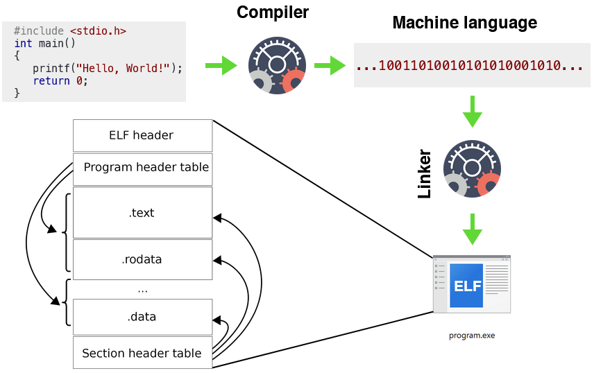
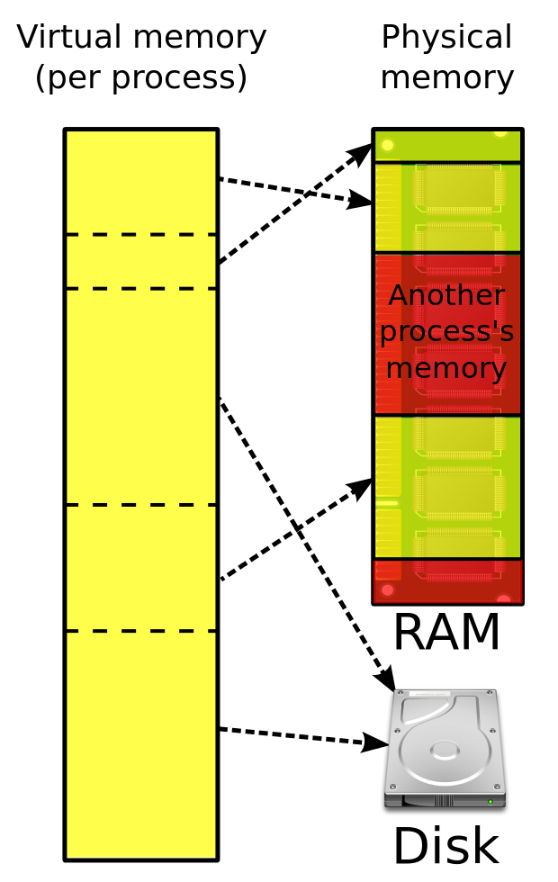
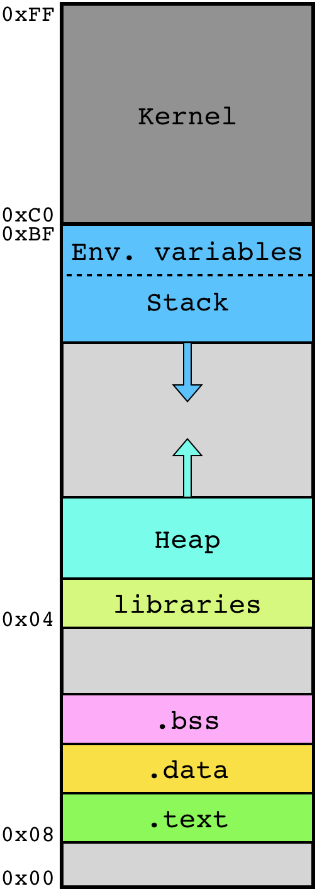
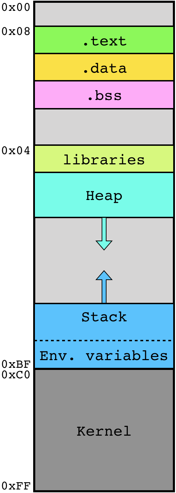
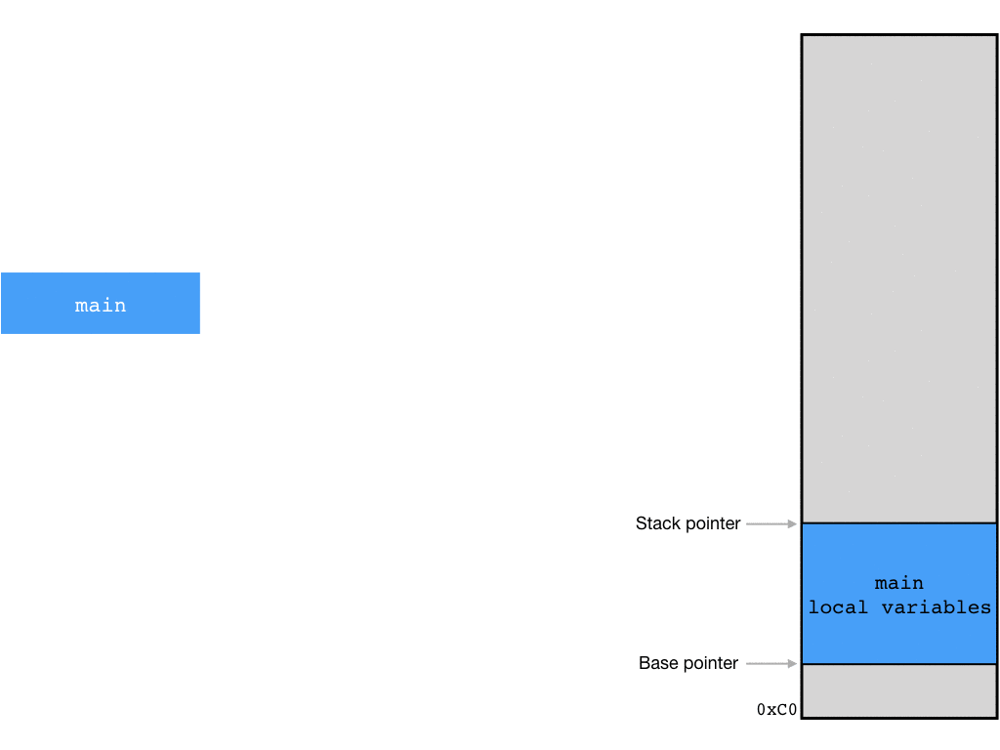
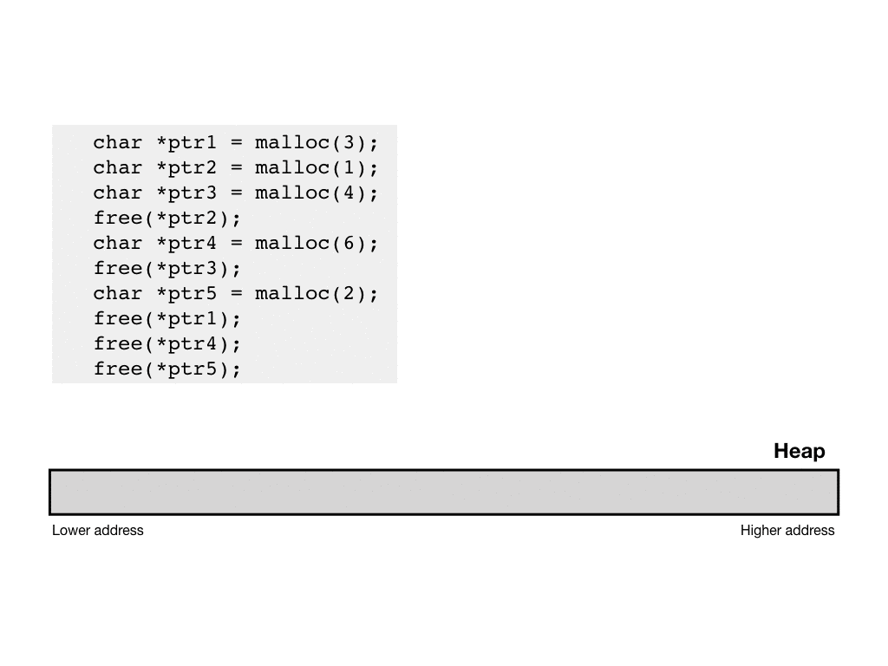
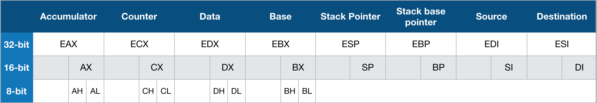
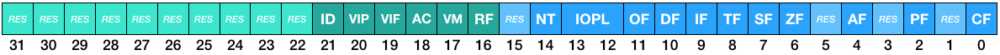

# Memory

Memory is a core component of a computer system. Without memory, there would be no place to store the instructions read and executed by the CPU and there would be no place to store the arguments and output of operations. A CPU without memory would be thus useless. But what is _memory_? Before going further, it is important to differentiate **storage** and **memory**. While those two terms are interchangeable in some literature, this course will differentiate them.

* **Storage** is the component of your computer that allows you to store and access data on a _long-term_ basis \[[1](https://www.kingston.com/en/community/articledetail/articleid/29685)\]. The most known storage media are SSD, hard drive or USB flash drive. The main difference with memory components is that storage systems retain the data, even when not powered. This means when the computer switches off, memory clears its content while storage data remains intact.
* **Memory** is the component of your computer that allows you to access and store data meant for a _short-term_ use. The main advantages of memory is the fast access \(read and write\) compare to storage media: between 200-550MB/s for SSD storage \[[2](https://www.storagereview.com/ssd_vs_hdd)\] and between 17-25.6GB/s for DDR4 memory \[[3](https://www.transcend-info.com/Support/FAQ-292)\].

While the storage contains the data at rest, the memory contains the data currently in used, including the instructions of all applications running and the data associated.

So, memory is the place where the data is stored. As we’ve seen in the chapter [Central Processing Unit](cpu.md), data could be anything: variable, image, instruction, etc. In the memory, there is nothing that explains what type of data is stored at any location. There is nothing that explains where the data start and where it ends. Most data type doesn’t have delimiter that tells “you reach the end of the variable”. So that means if you pick data at a random address in the memory, you shouldn’t be able to tell whether this value is meant to be an integer, an instruction or a string. Stored data only makes sense when manipulated by instructions that is aware of the context.

## ELF/PE file

The translation between a code written in a programming language, such as C, and machine instructions is done by a **compiler**. Once the code compiled, you get one \(or more\) _object\(s\)_. An _object_ on its own cannot do much; the operating system doesn’t know what to do with it. That’s why after compilation, the **linker** will put the objects together and generates a binary application packed in a specific file format so that whenever you run the file \(double-click on the icon or execute in a terminal\), the operating system knows how to load the program in memory and where to start \(first instruction\).

The two most known application formats are **ELF** \(Executable and Linkable Format\) for _Linux_ application and **PE** \(Portable Executable\) for _Windows_ application. _ELF_ and _PE_ formats are different but still share common main features. The loading process of an application is quite similar from Windows to Linux, therefore, this course will stay generic and give an overview of the process in general.



The executable \(ELF or PE file\) contains \(among others\) the following parts:

* **Entry Point**: The address where to start once the application is loaded in memory
* **Sections**: A program usually contains several sections. A section corresponds to an address space of a program, which contains specific data \(instruction, static variable, etc\). You can have several sections \(up to 65535\) using any name, however, the most common section names are _.text_, _.data_ and _.bss_.
  * _.text_: Typically contains instructions \(the code executed by the CPU\).
  * _.data_: Typically contains initialized data \(e.g. `char string[] = "Hello World";`\).
  * _.bss_: Typically contains all global variables and static variables that are initialized to zero or do not have explicit initialization in the source code \(e.g. `static int i;`\).
* **Import table**: Most applications rely on functions located in different _libraries_ \(i.e. a collection of pre-compiled functions\). So, for instance when using `printf`, the code of the function is not in the program itself but in the library `libc.so` \(in Linux\). When the application is executed, the startup routine loads all libraries that the application uses and map them into memory. This can be done thanks to the list of libraries \(and function\) from the _import table_.
* **Mapping**: Contains a map of what should be loaded from the file to which address \(offset\) in memory.


Program can be compiled with static libraries or dynamic/shared libraries. Shared library means the instructions from imported functions reside in different libraries/files \(as we’ve seen with the import table\). Whilst static library means the actual instructions of imported functions are copied in the program itself so that the program doesn’t rely on different libraries/files \(the import table is thus empty\). \[[4](https://medium.com/@StueyGK/static-libraries-vs-dynamic-libraries-af78f0b5f1e4)\]


## Memory address

Once you run an application, the operating system will first allocate some space in memory to load the application. Since we are working with a 32-bit computer, the program can only access addresses in memory that fit within 32 bits \(due to the design of the CPU \[[5](https://www.brianmadden.com/opinion/The-4GB-Windows-Memory-Limit-What-does-it-really-mean)\]\), which means between `00000000000000000000000000000000` \(0\) and `11111111111111111111111111111111` \(4,294,967,295\). So by default, whenever you run an application, the operating system allocate 4GB \(4,294,967,295\) of _virtual memory_ for that application. 

Here, we talk about virtual memory and not RAM. Of course, the Operating System wouldn't be able to allocate 4GB in RAM for each application as most computers wouldn’t have enough memory to run more than 3 applications \(including the OS\) at the same time. It is therefore important to understand the concept of _virtual memory_. 

_Virtual memory_ is an abstraction of the physical memory \(RAM\), where the data is actually stored in non-consecutive areas. This is a huge advantage for applications so that they don’t have to take into consideration how to distribute the data across the RAM and keep track where is what. Instead, applications see one unique continuous block of memory and let the operating system deal with the translation to the actual location of the data in RAM.



Furthermore, the concept of virtual memory allows to have shares memory accross multiple applications. For instance, if we load the a library such as _libc_, which is used in most applications, the library is loaded once in RAM but used in several virtual memories. 

Once the memory allocated, the OS \(actually the _dynamic linker_\) will map the binary application in memory according to its mapping table then load libraries. Once done, the execution of the program starts at the _entry point_. Most of the program when loaded do not need 4GB, therefore, all unmapped virtual memory do not take space in the actual RAM.


We only kept the main steps relevant for this course. The process has been simplified and some steps are missing \[[6](https://stackoverflow.com/a/5130690)\].


The command `readelf` allows you to parse and extract information from the ELF file. For instance, the entry point of the application `ls` can be found with the following command:

```text
$ readelf --file-header /bin/ls
ELF Header:
...
  Entry point address:               0x804bee9
...
```

The sections mapping table can be listed with the following command:

```text
$ readelf --section-headers /bin/ls
There are 29 section headers, starting at offset 0x1f478:

Section Headers:
  [Nr] Name              Type            Addr     Off    Size   ES Flg Lk Inf Al
   ...
  [14] .text             PROGBITS        08049df0 001df0 0117f4 00  AX  0   0 16
  ...
  [25] .data             PROGBITS        080681e0 01f1e0 000164 00  WA  0   0 32
  [26] .bss              NOBITS          08068360 01f344 000c18 00  WA  0   0 32
   ...
Key to Flags:
  W (write), A (alloc), X (execute), M (merge), S (strings)
  I (info), L (link order), G (group), T (TLS), E (exclude), x (unknown)
  O (extra OS processing required) o (OS specific), p (processor specific)
```

In this example, once the dynamic linker has allocated the 4GB of virtual memory, the section _.text_ of `/bin/ls` will be copied at the address `0x08049df0`.

Memory location are addressed per bytes \(8 bits\). This means the address `0x00000000` is pointing to the first byte in memory, the address `0x00000001` is pointing to the second byte \(or 9th bit\) in memory, etc. Although an address is always pointing to a byte, we can access several bytes at a time \(1, 2 or 4 bytes\) depending on the instruction executed. For instance, whenever we use the instruction `mov eax, [0x11223344]` \(see in chapter [assembly](assembly.md#mov-move-data)\),  we copy 4 bytes starting at the address `0x11223344` and we copy it in the register `eax`. This means the byte at `0x11223344`, the byte at `0x112235`, the byte at `0x112236` and the byte at `0x112237` are concatenated and saved in the register `eax`.

## Memory layout

Now that the program is running, we have the binary file as well as the libraries mapped in the virtual memory, but that’s not all. We also need memory space for local variables, dynamically allocated memory blocks, and OS related memory. All this is also in the virtual memory in specific areas. 

Below is a diagram that represent the main areas of the virtual memory.



In this diagram, the lowest memory \(smallest memory address\) is at the bottom and the highest at the top. However, some people prefer to represent the memory the other way round, i.e. starting with the lowest memory at the top.



I personally prefer this representation \(lowest at the top\) because later, when using _debuggers_, memory areas are usually represented in that order.


Those diagrams represent the layout for 32-bit Linux application. The main difference with 32-bit Windows application is the repartition between kernel-land \(2GB\) and user-land \(2GB\).


### Kernel and user-land

In Linux, the user-land is located between `0x00000000` and `0x0CFFFFFF`, while the kernel-land is located between `0xC0000000` and `0xFFFFFFFF`. This means the first two bits of kernel addresses always start with `11` \(`0xC0` = `11000000` and `0xFF` = `11111111`\). 

Operating systems are responsible — among many other things — to manage privileges. For instance, as a normal user, you should not be able to access the files on the desktop of another users. But what if you create an application where the instructions tell the CPU to open and edit a file that you don’t have read/write permissions on it, how is the CPU supposed to know whether to execute the instruction or not?

All operations that requires privileges \(on the operating system level\) has to go through a **system call** such as [open](https://en.wikipedia.org/wiki/Open_%28system_call%29), [read](https://en.wikipedia.org/wiki/Read_%28system_call%29) or [write](https://en.wikipedia.org/wiki/Write_%28system_call%29). Whenever a **system call** is executed, a software interrupt/exception \(SWI\) is triggered, which redirect the execution flow to a routine that check the initial system call and its parameter and switch from user-land to kernel-land and start executing kernel instructions on behalf of the user process \[[7](https://stackoverflow.com/a/11906590)\].

Once in kernel-land, you have a larger set of instructions  available, such as accessing a file. The CPU verifies whether the instructions are run from kernel-land simply by checking whether the address of the instruction executed starts with `11`. Prior to accessing the file, the kernel will verify who executed the system call and if it has the right to access it.


Of course, user-land instructions cannot read/write/edit instruction in kernel-land.


### Stack

The stack is a region in memory where data is added or removed in a last-in-first-out \(LIFO\) manner. This area of memory is typically used to store:

* Arguments sent to functions;
* Return addresses;
* Stack base pointers; and
* Local variables of functions.

In order to have a better understanding of the stack, here is a code example. Let’s consider the following C code:

```c
#include <stdio.h>

int add(int, int);
int mul(int, int);


int main()
{
    int four, three, result;

    four = 4;
    three = 3;

    result = mul(four, three);

    printf("%d x %d = %d\n", four, three, result);

    return 0;
}


int mul(int x, int y)
{
    int number, multiplier, result, i;

    number = x;
    multiplier = y;
    result = 0;
    i = 0;

    while (i < multiplier)
    {
        result = add(result, number);
        i = i + 1;
    }

    return result;
}


int add(int a, int b)
{
    int first, second, result;

    first = a;
    second = b;

    result = first + second;

    return result;
}
```


This code is a simple multiplier that only uses addition as mathematical operation.


In this example, the function `main()` calls the function `mul()`, and the function `mul()` calls the function `add()` multiple times.


Each function has its own _stack frame_. Whenever `main()` calls `mul()`, a new stack frame is added on top of the current one. A stack frame can grow and reduce with temporary local variables. A stack frame is usually structured as follow:

1. **Function arguments**: When a function is called, it generally receives arguments, e.g. in the call `mul(4,3)`, the first argument is `4` and the second argument is `3`. In this example, arguments are integers, but this could be any data \(float, string, etc\).
2. **The return address**: We will see it later in chapter [assembly](assembly.md), but basically, whenever a function is called, the CPU jumps to a different address in memory where the first instruction of the called function is located. At the end of the function, the CPU needs to return back to the instruction right after the initial call of the function. In order to know where to return, the address is saved in the stack.
3. **The stack base pointer of the callee function**: The _base pointer_ points to the beginning of the stack frame. Actually, to be precise, the base pointer doesn’t point exactly at the beginning of the frame but rather the beginning of the local variable.
4. **Local variables**: When local variables are initialized, those are actually located in the stack. So, for instance, if you have `int a;`, it allocated 4 bytes in the stack for the integer variable `a` \(integer are 4 bytes\).



We will see more examples with the stack in the chapter [assembly](assembly.md).

### Heap

Variables are areas in memory that are allocated to store their contents. There are three ways to allocate memory for a variable:

* **Static memory allocation**: The memory is allocated whenever the program starts. It is a fixed address with a fixed size. Static allocations are used whenever variables are defined with `static`\(e.g. `static int a;`\).
* **Automatic memory allocation**: The memory is allocated at the beginning of the stack frame whenever the function is called. The variable lasts as long as the function is running. Once the function is finished, the stack frame is clear and the memory is no longer allocated for the variable.
* **Dynamic memory allocation**: The memory is allocated when `malloc()` or `calloc()` are used. Both take as argument the size you want to allocate in memory then return a pointer to this newly allocated memory. The memory will be allocated until explicitly un-allocated with the function `free()`. \[[8](https://stackoverflow.com/a/8385488)\]


Automatic memory allocation doesn’t need to take place in the stack, but this is the most seen method.


The **heap** is a region in memory where **dynamically allocated variables** are stored. Being able to dynamically allocated memory can be useful in many cases:

* When you don’t know how many variables you need. For instance, you created an application that allows you to create your family tree. The developer doesn’t know how many members you have in your family. Therefore, each time you add a new relative, the program will dynamically allocate memory to store the person’s data.
* When you know the size of a variable only at runtime. For instance, if you want to store the biography for each member of your family and you don’t want to have a text length restriction, developers can use dynamically allocated memory to fit the biography.
* When you know at compile time the variable size, but it’s just too big for the stack \(typically a few MBs at most\), sometimes, it doesn’t make sense to make such big variable global. For instance, if it’s a compressed variable that you want to unpack at runtime.
* When you need to have a variable that still exists once the function finishes so it can be used in a different function. \[[9](https://stackoverflow.com/a/3889495)\]

Four functions are used to manage the memory in the heap:

<table>
  <thead>
    <tr>
      <th style="text-align:left">Function</th>
      <th style="text-align:left">Return value</th>
      <th style="text-align:left">Arguments</th>
      <th style="text-align:left">Description</th>
    </tr>
  </thead>
  <tbody>
    <tr>
      <td style="text-align:left"><a href="http://www.cplusplus.com/reference/cstdlib/malloc/"><code>malloc</code></a>
      </td>
      <td style="text-align:left">On success, a pointer to the memory block allocated by the function. The
        type of this pointer is always <code>void*</code>, which can be cast to
        the desired type of data pointer in order to be dereferenceable. If the
        function failed to allocate the requested block of memory, a <code>null</code> pointer
        is returned.</td>
      <td style="text-align:left"><code>size</code>: size of the new memory block to allocate in bytes.</td>
      <td
      style="text-align:left">Allocates a block of <code>size</code> (argument) bytes of memory, returning
        a pointer to the beginning of the block. The content of the newly allocated
        block of memory is not initialized, remaining with indeterminate values.</td>
    </tr>
    <tr>
      <td style="text-align:left"><a href="http://www.cplusplus.com/reference/cstdlib/calloc/"><code>calloc</code></a>
      </td>
      <td style="text-align:left">On success, a pointer to the memory block allocated by the function. The
        type of this pointer is always <code>void*</code>, which can be cast to
        the desired type of data pointer in order to be dereferenceable. If the
        function failed to allocate the requested block of memory, a <code>null</code> pointer
        is returned.</td>
      <td style="text-align:left">
        <p><code>num</code>: Number of elements to allocate.</p>
        <p><code>size</code>: Size of each element.</p>
      </td>
      <td style="text-align:left">Allocates a block of memory for an array of <code>num</code> elements, each
        of them <code>size</code> bytes long, and initializes all its bits to zero.
        The effective result is the allocation of a zero-initialized memory block
        of (<code>num</code>&#xD7;<code>size</code>) bytes.</td>
    </tr>
    <tr>
      <td style="text-align:left"><a href="http://www.cplusplus.com/reference/cstdlib/realloc/"><code>realloc</code></a>
      </td>
      <td style="text-align:left">A pointer to the reallocated memory block, which may be either the same
        as <code>ptr</code> (argument) or a new location. The type of this pointer
        is <code>void*</code>, which can be cast to the desired type of data pointer
        in order to be dereferenceable.</td>
      <td style="text-align:left">
        <p><code>ptr</code>: Pointer to a memory block previously allocated with
          malloc, calloc or realloc.</p>
        <p><code>site</code>: New size for the memory block, in bytes.</p>
      </td>
      <td style="text-align:left">Changes the size of the memory block pointed to by <code>ptr</code>. The
        function may move the memory block to a new location (whose address is
        returned by the function). The content of the memory block is preserved
        up to the lesser of the new and old sizes, even if the block is moved to
        a new location. If the new size is larger, the value of the newly allocated
        portion is indeterminate. In case that <code>ptr</code> is a null pointer,
        the function behaves like malloc, assigning a new block of size bytes and
        returning a pointer to its beginning.</td>
    </tr>
    <tr>
      <td style="text-align:left"><a href="http://www.cplusplus.com/reference/cstdlib/free/"><code>free</code></a>
      </td>
      <td style="text-align:left">none</td>
      <td style="text-align:left"><code>ptr</code>: Pointer to a memory block previously allocated with
        malloc, calloc or realloc.</td>
      <td style="text-align:left">A block of memory previously allocated by a call to malloc, calloc or
        realloc is deallocated, making it available again for further allocations.
        Notice that this function does not change the value of <code>ptr</code> itself,
        hence it still points to the same (now invalid) location.</td>
    </tr>
  </tbody>
</table>

Source: [malloc](http://www.cplusplus.com/reference/cstdlib/malloc/), [calloc](http://www.cplusplus.com/reference/cstdlib/calloc/), [realloc](http://www.cplusplus.com/reference/cstdlib/realloc/) and [free](http://www.cplusplus.com/reference/cstdlib/free/).

Here is an example of dynamic memory allocation with malloc and free.



### Imported libraries

Operating systems comes with libraries that contains a large list of native functions you can directly call, such as [`pow`](http://www.cplusplus.com/reference/cmath/pow/), [`printf`](http://www.cplusplus.com/reference/cstdio/printf/), [`scanf`](http://www.cplusplus.com/reference/cstdio/scanf/) or [`fopen`](http://www.cplusplus.com/reference/cstdio/fopen/). Built-in OS libraries are meant to facilitate the development of applications by providing functions doing basic/essential functionalities \(although sometimes complex to implement \[[10](http://www.equestionanswers.com/c/c-printf-scanf-working-principle.php)\]\) like reading user input from the terminal with `scanf`. 

Developers can also write their own library. Let say they created a function that can be re-used in other programs, they can compile/link the function in a separated file \(library\) and import that library in the program that uses functions from it.

In Linux C, there are two types of libraries:

* **Static libraries** \(.a\): The library is added directly in the final binary application when compiled/linked.
* **Dynamically linked shared object libraries** \(.so\): The library is not added in the file but loaded at runtime.

The main advantage of static libraries is that the final binary application should be able to run on its own. However, if you do any modification of the function in the library, you need to re-compile the application to apply the changes. While with the dynamically linked shared object libraries, you only need to edit the library and the changes will be effective next time the application is executed. However, if the library file is missing or corrupted, the application won’t work. Another benefit of shared libraries is that multiple application can use the same library while with static libraries, there is a copy of the library in each running application using it.

A shared library used by multiple applications means the library is loaded only once in the physical RAM but used in multiple applications and thus in multiple virtual memories at the exact same virtual address. This means the memory location of a shared address is not hardcoded in the binary since before the application is running, there is no way to predict where the memory will be loaded since it depends on where it has been loaded at the first time in a different application. Since the address of the library is unknown during compile/link time, how does the application find the location of imported functions?

The function `printf` for instance is located in the shared library `/lib/i386-linux-gnu/libc.so.6`. By default, GCC always includes the shared library `libc`, so there is no need to specify it when compiling. For instance, let’s consider the following code `hello.c`:



```c
#include <stdio.h>

int main()
{
    printf("Hello World");

    return 0;
}
```



If we compile with `gcc`, then use the command `ldd` to print the shared object dependencies, we can see that the shared `libc` library has been linked:

```text
$ gcc hello.c -o hello
$ ldd hello
    linux-gate.so.1 =>  (0xb7f95000)
    libc.so.6 => /lib/i386-linux-gnu/libc.so.6 (0xb7dc5000)
    /lib/ld-linux.so.2 (0xb7f97000)
```


More information about the compiler in chapter lab


Although the `libc` library is meant to be used as a _dynamically linked shared object library_, it is possible to add it directly in the final binary application as a _static library_ by using the option `-static`with `gcc`:

```text
$ gcc hello.c -o hello_static -static
$ ldd hello_static
    not a dynamic executable
```

However, the application `hello_static` will be much bigger since the library will be copied in the program: `hello` is 7,2K and `hello_static` is 712K


Unused functions won’t be added in the program


Now, let’s have a look at how the functions from shared libraries are loaded. First of all, libraries have an _export table_. It’s a table that lists all exported functions \(e.g. `printf`\) and tells at which offset the function is located. To see the list of exported functions, you can use either `mn -D <libfile>`, `readelf -s <libfile>` or `objdump -T <libfile>`:

```text
$ objdump -T /lib/i386-linux-gnu/libc.so.6

libc.so.6:     file format elf32-i386

DYNAMIC SYMBOL TABLE:
...
000ea380  w   DF .text    0000009e  GLIBC_2.0   iswalnum
0007d810 g    DF .text    00000020  GLIBC_2.1.1 __strrchr_c
00025130  w   DF .text    00000008  GLIBC_2.1   __toascii_l
00025170 g    DF .text    00000016  GLIBC_2.1   __isalnum_l
00049670 g    DF .text    0000002a  GLIBC_2.0   printf
000e0970 g    DF .text    000003b3  GLIBC_2.2   __getmntent_r
000fb3e0 g    DF .text    00000048  GLIBC_2.0   ether_ntoa_r
0002b230  w   DF .text    00000011  GLIBC_2.0   finite
000e8060  w   DF .text    0000006e  GLIBC_2.0   __connect
...
```


The list does not only contains exported functions but all exported symbols, which also includes exported variables.


The first line contains the offset where to find the function when loaded in memory. So this means the function `printf` is not located at `0x49670` in the file `libc.so.6`, but `printf` will be located at an offset of `0x49670` starting from where `libc.so.6` is loaded in memory.

While we can easily get the offset, the location of `libc.so.6` \(and shared library in general\) in memory is only known at runtime. This means the linker at compile time doesn’t know the exact address of `libc` and thus the address of `printf`. Instead, the linker redirects the `printf` call to the _dynamic linker runtime resolver_ \(i.e. `_dl_runtime_resolve`\) function. The resolver takes two arguments: \(1\) a pointer to a structure containing dynamic linkage information \(including the address of `libc` in memory\) and \(2\) an index in the relocation entry table `rel.plt`. The table can be listed with `readelf`:

```text
$ readelf --relocs hello

...
Relocation section '.rel.plt' at offset 0x29c contains 2 entries:
 Offset     Info    Type            Sym.Value  Sym. Name
0804a00c  00000107 R_386_JUMP_SLOT   00000000   printf@GLIBC_2.0
0804a010  00000307 R_386_JUMP_SLOT   00000000   __libc_start_main@GLIBC_2.0
```

So if we want to _resolve_ the function `printf`, the second argument should be `0` \(i.e. the first entry in `rel.plt`\). The function `_dl_runtime_resolve` will resolve \(calculate\) the address of `printf` based on the address of `libc` in memory and the offset where the function `printf` is located \(in our case, `0x00049670`\). Once resolved, the function replaces the `printf` redirection added by the linker with the actual address of `printf` in `libc` so that the next time `printf` is called, there is no need to calculate the address once again \[[11](https://www.slideshare.net/kentarokawamoto/runtime-symbol-resolution)\].

The reason why the application resolves addresses from shared library upon the first call instead of resolving and patching everything at once when the application is loaded is because it might be too time-consuming. Some application can contain a lot of _reference_ to shared libraries. So much that it would take considerably more time to start\[[12](https://reverseengineering.stackexchange.com/a/20214)\].

### Static/hard coded data

As mentioned earlier in the sub-chapter _ELF/PE file_, an application can have many sections, the most known being: _.text_, _.data_, and _.bss_. The size of those segments are determined by the size of the values in the program’s source code and does not change at run time.

The _.data_ section contains any global or static variables which have a pre-defined value and can be modified. That is any variables that are not defined within a function \(and thus can be accessed from anywhere\) or are defined in a function but are defined as `static` so they retain their address across subsequent calls. Examples, in C, include:

```c
int val = 3;
char string[] = "Hello World";
```

The values for these variables are initially stored within the read-only memory \(typically within _.text_\) and are copied into the _.data_ section during the start-up routine of the program.

The _.bss_ section is usually adjacent to the data segment. It contains all global variables and static variables that are initialized to zero or do not have explicit initialization in the source code. For instance, a variable defined as `static int i;` would be contained in the BSS segment.

The _.data_ and _.bss_ sections are read-write since the values of variables can be altered at run time. This is in contrast to the read-only data segment \(_.rodata_\), which contains static constants rather than variables\[[13](https://en.wikipedia.org/wiki/Data_segment)\].

### Instructions

The _.text_ section contains the translation of the source code in machine instructions. Those instructions are sent and executed by the CPU. Those instructions consist of moving data, redirect the execution flow and execute mathematical and logical operations. There is a quite large set of instructions \(around 1500 \[[14](https://fgiesen.wordpress.com/2016/08/25/how-many-x86-instructions-are-there/)\]\) available for the i386 architecture. Fortunately, the 20 most used instructions make 90% of an application, so if learn those 20 instructions, you should be able to read most of the code.

Unlike in ARM instructions, the size in memory for a single i386 instruction can vary from 1 to 15 bytes \(although most instructions are between 1 and 5 bytes\). When reading machine instructions, we \(human\) usually don’t read directly what is stored in memory but rather its interpretation. For instance, the instruction `push 0x0`, which will basically push to the _stack_ the value `0x00000000` is `64 00`in memory. So while we \(human\) could technically remember that the value `64 00` is the instruction `push 0x0`, we are better at remembering meaningful words, that’s why all machine instructions can be directly translated in **assembly** \(also known as **asm**\). So assembly is a human-readable language that represents machine instructions. More info about assembly in the chapter assembly.

Instructions are stored one after another in memory, although not necessarily in chronological execution since the execution flow can be redirected. There is not delimiter between instructions and instructions have variable length, so CPU knows where the next instruction is based on the current one being executed. For instance, it knows that if it reads the value `64`, this is a `push` instruction that takes only one argument \(operand\) that is one byte long so the total instruction is 2 bytes and therefore, the next instruction is located two bytes after the current one.

## Registers

Registers are small memory locations built into the CPU, which increase the read/write access speed \(typically within 1 CPU clock \[[15](https://techdifferences.com/difference-between-register-and-memory.html)\]\). Since this course cover 32-bit architectures only, registers are also 32-bit long.

Most instructions executed by the CPU involve \(at least\) one register as operand. Besides the advantageous fast access to register, the design of the machine language does not allow memory-to-memory operations \[[16](https://www.quora.com/Why-can%E2%80%99t-two-operands-both-be-memory-operands-in-assembly-language)\]. So this means if we want to add two values stored in memory, we won't tell the CPU:


_add_ the value located at the address `0x11223344` with the value located at the address `0x44332211` and save the result in `0x12345678`


Instead, we will tell the CPU:


_move_ the value located at the address `0x11223344` in the register `EDX`, then _add_ the value located at the address `0x44332211`with the value in the register `EDX`


The instruction _add_ always saves the result in the first operand \(i.e. memory location at `0x11223344`\), so we will have to tell the CPU:


_move_ the content located at `0x11223344` and copy it at `0x12345678`


We could also move both values in registers and execute the addition, but this would require one additional instruction.

32-bit architectures have the following registers:

* 8 General-Purpose Registers \(GPR\)
* 1 Instruction Pointer
* 1 Flags Register
* 6 Segment Registers

### General-Purpose Registers

The 8 GPRs are:

* **A**​ccumulator register \(AX\): Used in arithmetic operations. This is also register used by default to stored the returned value of a function.
* **C**​ounter register \(CX\): Primarily used in loops as a counter. Also used in shift/rotate instructions.
* **D**​ata register \(DX\): Used in arithmetic operations and I/O operations.
* **B**​ase register \(BX\): Used as a pointer to data.
* **S**​tack **P**​ointer register \(SP\): Pointer to the top of the stack. This register is automatically updated when the instructions `push` and `pop` are executed.
* Stack **B**​ase **P**​ointer register \(BP\): Used to point to the base of the stack \(see sub-chapter _stack_\).
* **S**​ource **I**​ndex register \(SI\): Used as a pointer to a source in string/stream operations.
* **D**​estination **I**​ndex register \(DI\): Used as a pointer to a destination in string/stream operations.


The purpose of the first four registers \(`AX`, `CX`, `DX` and `BX`\) can be interchangeable. Even `SI` and `DI` can be used for a different purpose. These are guidelines, but if `BX` is used as a loop counter, the code will still work fine.


All registers can be accessed in 16-bit and 32-bit modes. In 16-bit mode, the register is identified by its two-letter abbreviation from the list above. In 32-bit mode, this two-letter abbreviation is prefixed with an `E` \(extended\). For example, `EAX` is the accumulator register as a 32-bit value. It is also possible to address the first four registers \(`AX`, `CX`, `DX` and `BX`\) in their size of 16-bit as two 8-bit halves. The least significant byte \(LSB\), or low half, is identified by replacing the `X` with an `L`. The most significant byte \(MSB\), or high half, uses an `H` instead. For example, `CL` is the least-significant bits \(LSB\) of the counter register \(`CX`\), whereas `CH` is its most-significant bits \(MSB\). \[[17](https://en.wikibooks.org/wiki/X86_Assembly/X86_Architecture#x86_Architecture)\].



### Instruction Pointer

The **I**​nstruction **P**​ointer \(EIP\) register contains the address of the next instruction to be executed \(unless the execution is redirected by the current instruction\). The register EIP cannot be read directly through an instruction.

### Flags Register

Initially called FLAGS on 16-bit architectures, then later EFLAGS on 32-bit architectures, the flags register is a special register where each bit represent a boolean value for a specific flag. Flags are automatically set by the CPU after specific operations.




_Res_ flags are reserved for future use.


The most important flags relevant for this course are:

* **C**​arry **F**​lag \(CF\): indicates whether an arithmetic [carry](http://mathworld.wolfram.com/Carry.html) or [borrow](http://mathworld.wolfram.com/Borrow.html) has been done on the most significant bit position.
* **P**​arity **F**​lag \(PF\): indicates whether the result of the last operation is even \(PF = `1`\) or odd \(PF = `0`\).
* **Z**​ero **F**​lag \(ZF\): indicates whether the result of the last operation is zero \(ZF = `1`\) or otherwise \(ZF = `0`\).
* **S**​ign **F**​lag \(SF\): indicates whether the result of the last operation has its most significant bit set to `1` \(SF = `1`\) or set to `0` \(SF = `0`\). As seen in chapter [CPU](cpu.md), a signed integer indicates its parity with the most-significant bit.
* **T**​rap **F**​lag \(TF\): indicates whether the CPU is in single-step mode \(TF = `1`\) or not \(TF = `0`\). The single-step mode is used to debug applications. When set, the CPU will execute one instruction and then stop so that you can examine the memory and registers between each instruction. This flag is used by debugger tools such as GDB, which will be covered in the next chapter [lab](lab.md).
* **O**​verflow **F**​lag \(OF\): indicate whether an arithmetic overflow has occurred in the last operation. An overflow happens when two operands are added and the sign bit \(most-significant bit\) is flipped. If the expected result is a signed integer, the next operation will see the result as a negative number. \[[18](https://en.wikipedia.org/wiki/Overflow_flag)\]

Remember the _ALU_ in chapter [CPU](cpu.md)? Well, _CF_, _PF_, _ZF_, _SF_ and _OF_ are part of the _status output_.

## References

* \[[1](https://www.kingston.com/en/community/articledetail/articleid/29685)\] [https://www.kingston.com/en/community/articledetail/articleid/29685](https://www.kingston.com/en/community/articledetail/articleid/29685)
* \[[2](https://www.storagereview.com/ssd_vs_hdd)\] [https://www.storagereview.com/ssd\_vs\_hdd](https://www.storagereview.com/ssd_vs_hdd)
* \[[3](https://www.transcend-info.com/Support/FAQ-292)\] [https://www.transcend-info.com/Support/FAQ-292](https://www.transcend-info.com/Support/FAQ-292)
* \[[4](https://medium.com/@StueyGK/static-libraries-vs-dynamic-libraries-af78f0b5f1e4)\] [https://medium.com/@StueyGK/static-libraries-vs-dynamic-libraries-af78f0b5f1e4](https://medium.com/@StueyGK/static-libraries-vs-dynamic-libraries-af78f0b5f1e4)
* \[[5](https://www.brianmadden.com/opinion/The-4GB-Windows-Memory-Limit-What-does-it-really-mean)\] [https://www.brianmadden.com/opinion/The-4GB-Windows-Memory-Limit-What-does-it-really-mean](https://www.brianmadden.com/opinion/The-4GB-Windows-Memory-Limit-What-does-it-really-mean)
* [`open`](https://en.wikipedia.org/wiki/Open_%28system_call%29): [https://en.wikipedia.org/wiki/Open\_%28system\_call%29](https://en.wikipedia.org/wiki/Open_%28system_call%29)
* [`read`](https://en.wikipedia.org/wiki/Read_%28system_call%29): [https://en.wikipedia.org/wiki/Read\_%28system\_call%29](https://en.wikipedia.org/wiki/Read_%28system_call%29)
* [`write`](https://en.wikipedia.org/wiki/Write_%28system_call%29): [https://en.wikipedia.org/wiki/Write\_%28system\_call%29](https://en.wikipedia.org/wiki/Write_%28system_call%29)
* \[[6](https://stackoverflow.com/a/5130690)\] [https://stackoverflow.com/a/5130690](https://stackoverflow.com/a/5130690)
* \[[7](https://stackoverflow.com/a/11906590)\] [https://stackoverflow.com/a/11906590](https://stackoverflow.com/a/11906590)
* \[[8](https://stackoverflow.com/a/8385488)\] [https://stackoverflow.com/a/8385488](https://stackoverflow.com/a/8385488)
* \[[9](https://stackoverflow.com/a/3889495)\] [https://stackoverflow.com/a/3889495](https://stackoverflow.com/a/3889495)
* [`malloc`](http://www.cplusplus.com/reference/cstdlib/malloc/): [http://www.cplusplus.com/reference/cstdlib/malloc/](http://www.cplusplus.com/reference/cstdlib/malloc/)
* [`calloc`](http://www.cplusplus.com/reference/cstdlib/calloc/): [http://www.cplusplus.com/reference/cstdlib/calloc/](http://www.cplusplus.com/reference/cstdlib/calloc/)
* [`realloc`](http://www.cplusplus.com/reference/cstdlib/realloc/): [http://www.cplusplus.com/reference/cstdlib/realloc/](http://www.cplusplus.com/reference/cstdlib/realloc/)
* [`free`](http://www.cplusplus.com/reference/cstdlib/free/): [http://www.cplusplus.com/reference/cstdlib/free/](http://www.cplusplus.com/reference/cstdlib/free/)
* [`pow`](http://www.cplusplus.com/reference/cmath/pow/): [http://www.cplusplus.com/reference/cmath/pow/](http://www.cplusplus.com/reference/cmath/pow/)
* [`printf`](http://www.cplusplus.com/reference/cstdio/printf/): [http://www.cplusplus.com/reference/cstdio/printf/](http://www.cplusplus.com/reference/cstdio/printf/)
* [`scanf`](http://www.cplusplus.com/reference/cstdio/scanf/): [http://www.cplusplus.com/reference/cstdio/scanf/](http://www.cplusplus.com/reference/cstdio/scanf/)
* [`fopen`](http://www.cplusplus.com/reference/cstdio/fopen/): [http://www.cplusplus.com/reference/cstdio/fopen/](http://www.cplusplus.com/reference/cstdio/fopen/)
* \[[10](http://www.equestionanswers.com/c/c-printf-scanf-working-principle.php)\] [http://www.equestionanswers.com/c/c-printf-scanf-working-principle.php](http://www.equestionanswers.com/c/c-printf-scanf-working-principle.php)
* [prototype](https://en.wikipedia.org/wiki/Function_prototype): [https://en.wikipedia.org/wiki/Function\_prototype](https://en.wikipedia.org/wiki/Function_prototype)
* \[[11](https://www.slideshare.net/kentarokawamoto/runtime-symbol-resolution)\] [https://www.slideshare.net/kentarokawamoto/runtime-symbol-resolution](https://www.slideshare.net/kentarokawamoto/runtime-symbol-resolution)
* \[[12](https://reverseengineering.stackexchange.com/a/20214)\] [https://reverseengineering.stackexchange.com/a/20214](https://reverseengineering.stackexchange.com/a/20214)
* \[[13](https://en.wikipedia.org/wiki/Data_segment)\] [https://en.wikipedia.org/wiki/Data\_segment](https://en.wikipedia.org/wiki/Data_segment)
* \[[14](https://fgiesen.wordpress.com/2016/08/25/how-many-x86-instructions-are-there/)\] [https://fgiesen.wordpress.com/2016/08/25/how-many-x86-instructions-are-there/](https://fgiesen.wordpress.com/2016/08/25/how-many-x86-instructions-are-there/)
* \[[15](https://techdifferences.com/difference-between-register-and-memory.html)\] [https://techdifferences.com/difference-between-register-and-memory.html](https://techdifferences.com/difference-between-register-and-memory.html)
* \[[16](https://www.quora.com/Why-can%E2%80%99t-two-operands-both-be-memory-operands-in-assembly-language)\] [https://www.quora.com/Why-can%E2%80%99t-two-operands-both-be-memory-operands-in-assembly-language](https://www.quora.com/Why-can%E2%80%99t-two-operands-both-be-memory-operands-in-assembly-language)
* \[[17](https://en.wikibooks.org/wiki/X86_Assembly/X86_Architecture#x86_Architecture)\] [https://en.wikibooks.org/wiki/X86\_Assembly/X86\_Architecture\#x86\_Architecture](https://en.wikibooks.org/wiki/X86_Assembly/X86_Architecture#x86_Architecture)
* [carry](http://mathworld.wolfram.com/Carry.html): [http://mathworld.wolfram.com/Carry.html](http://mathworld.wolfram.com/Carry.html)
* [borrow](http://mathworld.wolfram.com/Borrow.html): [http://mathworld.wolfram.com/Borrow.html](http://mathworld.wolfram.com/Borrow.html)
* \[[18](https://en.wikipedia.org/wiki/Overflow_flag)\] [https://en.wikipedia.org/wiki/Overflow\_flag](https://en.wikipedia.org/wiki/Overflow_flag)

